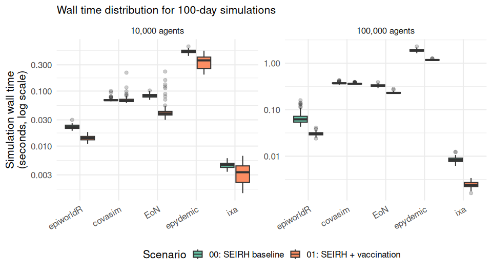
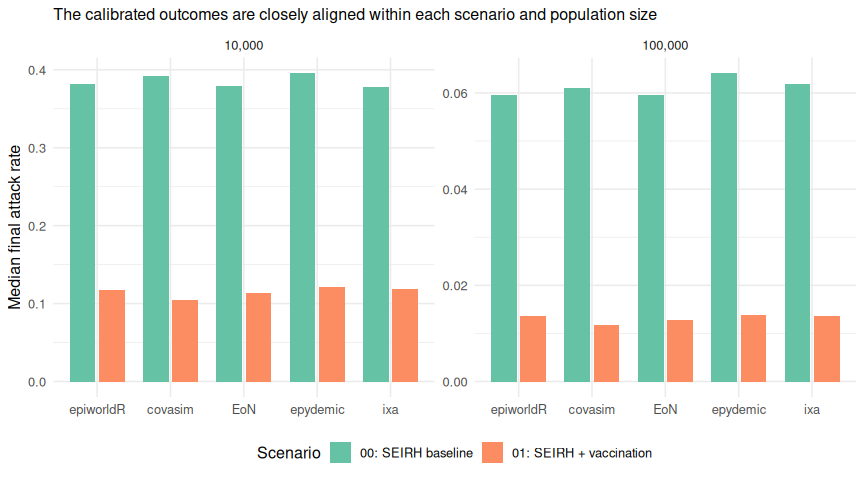

# Network epidemic ABM speed benchmark

2026-09-23

- [Executive summary](#executive-summary)
- [Simulation time](#simulation-time)
- [Cost of added complexity](#cost-of-added-complexity)
  - [Run time](#run-time)
  - [Code required to define the
    model](#code-required-to-define-the-model)
- [Speed relative to epiworldR](#speed-relative-to-epiworldr)
- [Epidemiological sanity checks](#epidemiological-sanity-checks)
- [Design and interpretation](#design-and-interpretation)
- [Reproducibility and cache](#reproducibility-and-cache)
- [References](#references)

## Executive summary

This benchmark compares simulation speed for 100-day network epidemics
at 10,000 and 100,000 agents, with 100 independent replicates per
engine, size, and scenario. The included engines are
<a href="https://uofuepibio.github.io/epiworldR/"
target="_blank">epiworldR</a> (Meyer and Vega Yon 2023),
<a href="https://covasim.org/" target="_blank">Covasim</a> (Kerr et al.
2021),
<a href="https://epidemicsonnetworks.readthedocs.io/en/latest/EoN.html"
target="_blank">EoN</a> (Miller and Ting 2019),
<a href="https://github.com/simoninireland/epydemic"
target="_blank">epydemic</a> (Dobson 2022), and
<a href="https://ixa.rs/" target="_blank">ixa</a> (The Ixa Developers
2026). All engines use the exact same cached Watts–Strogatz edge list
for a population size (mean degree 10, rewiring probability 0.05) and
target an early-outbreak $R_0 = 2$. epiworldR and EoN run at the
analytic transmission rate. The restricted Covasim cells apply
size-specific transmission multipliers of 0.715 at 10,000 agents and
0.710 at 100,000 agents, and the ixa cells apply 0.983 and 0.988. These
empirical factors align realized attack rates under the frameworks’
different transmission semantics.

The benchmark is organized in scenarios of increasing complexity, so
that it shows how run time and the code needed to define the model
change as the model grows. Each scenario is a folder with its own
specification and one runner per engine; [scenarios.md](scenarios.md)
describes how to add one.

| Scenario | Name | Description | Details |
|:---|:---|:---|:---|
| 00 | SEIRH baseline | SEIRH epidemic with a hospitalization branch and no interventions. | [scenario_00/README.md](scenario_00/README.md) |
| 01 | SEIRH + vaccination | Scenario 00 plus a day-0 all-or-nothing vaccine: 30% coverage, 80% efficacy. | [scenario_01/README.md](scenario_01/README.md) |

> [!TIP]
>
> The complete 2,000-run design is available.

| Field               | Value                                                 |
|:--------------------|:------------------------------------------------------|
| Platform            | Linux-6.12.13-200.fc41.aarch64-aarch64-with-glibc2.39 |
| Python              | 3.12.11                                               |
| Workers             | 1                                                     |
| Latest run failures | 0                                                     |

| Scenario | Engine    | Agents | Runs | Median simulation (s) | Q1 (s) | Q3 (s) |
|:---------|:----------|-------:|-----:|----------------------:|-------:|-------:|
| 00       | ixa       |  10000 |  100 |                 0.004 |  0.004 |  0.005 |
| 00       | epiworldR |  10000 |  100 |                 0.022 |  0.021 |  0.024 |
| 00       | covasim   |  10000 |  100 |                 0.068 |  0.067 |  0.070 |
| 00       | EoN       |  10000 |  100 |                 0.083 |  0.078 |  0.087 |
| 00       | epydemic  |  10000 |  100 |                 0.526 |  0.502 |  0.552 |
| 00       | ixa       | 100000 |  100 |                 0.008 |  0.008 |  0.009 |
| 00       | epiworldR | 100000 |  100 |                 0.062 |  0.054 |  0.072 |
| 00       | EoN       | 100000 |  100 |                 0.327 |  0.316 |  0.342 |
| 00       | covasim   | 100000 |  100 |                 0.369 |  0.363 |  0.378 |
| 00       | epydemic  | 100000 |  100 |                 1.867 |  1.808 |  1.953 |
| 01       | ixa       |  10000 |  100 |                 0.003 |  0.002 |  0.004 |
| 01       | epiworldR |  10000 |  100 |                 0.014 |  0.013 |  0.015 |
| 01       | EoN       |  10000 |  100 |                 0.039 |  0.037 |  0.043 |
| 01       | covasim   |  10000 |  100 |                 0.067 |  0.064 |  0.071 |
| 01       | epydemic  |  10000 |  100 |                 0.361 |  0.255 |  0.414 |
| 01       | ixa       | 100000 |  100 |                 0.002 |  0.002 |  0.003 |
| 01       | epiworldR | 100000 |  100 |                 0.030 |  0.029 |  0.032 |
| 01       | EoN       | 100000 |  100 |                 0.229 |  0.225 |  0.235 |
| 01       | covasim   | 100000 |  100 |                 0.359 |  0.355 |  0.364 |
| 01       | epydemic  | 100000 |  100 |                 1.168 |  1.156 |  1.189 |

## Simulation time

The primary measure is wall-clock time inside each engine’s simulation
call. The logarithmic scale keeps fast and slow engines legible in one
panel, and the scenarios sit side by side for each engine.

## Cost of added complexity

### Run time

Each later scenario is compared with scenario 00 replicate by replicate:
the engine, population size, seed, network, and calibration are the
same, and only the model differs. Values above one mean that the more
complex scenario took longer.

| Scenario | Engine    | Agents | Median time / scenario 00 |   Q1 |   Q3 |
|:---------|:----------|-------:|--------------------------:|-----:|-----:|
| 01       | EoN       |  10000 |                      0.48 | 0.43 | 0.54 |
| 01       | epiworldR |  10000 |                      0.61 | 0.57 | 0.67 |
| 01       | epydemic  |  10000 |                      0.71 | 0.48 | 0.78 |
| 01       | ixa       |  10000 |                      0.74 | 0.48 | 0.95 |
| 01       | covasim   |  10000 |                      0.97 | 0.93 | 1.05 |
| 01       | ixa       | 100000 |                      0.29 | 0.27 | 0.32 |
| 01       | epiworldR | 100000 |                      0.50 | 0.41 | 0.57 |
| 01       | epydemic  | 100000 |                      0.63 | 0.59 | 0.66 |
| 01       | EoN       | 100000 |                      0.71 | 0.67 | 0.74 |
| 01       | covasim   | 100000 |                      0.97 | 0.95 | 1.01 |

Run time does not isolate the cost of the extra machinery. Scenario 01’s
vaccine protects about a quarter of the population, which cuts the
median attack rate from about 0.38 to 0.11 at 10,000 agents and from
0.06 to 0.013 at 100,000. Engines whose work tracks the number of active
infections (EoN, epydemic, epiworldR, and ixa) get faster for that
reason alone. Covasim’s vectorized daily update touches every agent
regardless of the outbreak’s size, so its time barely moves. A ratio
below one therefore does not mean the vaccine is free. It means that the
engine’s handling of the vaccine costs less than the smaller outbreak
saves. A ratio above one would mean the feature itself is expensive, as
`distribute_tool_to_set()` made it for epiworldR (see [Design and
interpretation](#design-and-interpretation)).

### Code required to define the model

A rough measure of effort: how much code each engine needs to express
each scenario. *Model lines* counts non-blank, non-comment lines that
build the population and network, define the disease and interventions,
and run the simulation. Argument parsing, edge-file reading, timing, and
writing results are excluded because every runner shares them. *Files*
counts the files a user writes, including build manifests. They are
counted from the runner sources when this report is rendered, using the
regions listed in each scenario’s `code_regions.yml`.

| Engine | Language | Files | Lines, scenario 00 | Lines, scenario 01 | Added in scenario 01 |
|:---|:---|---:|---:|---:|---:|
| EoN | Python | 1 | 37 | 44 | 7 |
| epiworldR | R | 1 | 47 | 62 | 15 |
| covasim | Python | 1 | 64 | 75 | 11 |
| epydemic | Python | 1 | 70 | 88 | 18 |
| ixa | Rust | 3 | 133 | 164 | 31 |

Model lines vary with how much of the model an engine provides built in.
For example, EoN describes transitions as rate graphs, Covasim needs its
native parameters overridden to restrict it to SEIRH, and the ixa runner
writes its daily step by hand. The Python engines share one runner file
per scenario, and ixa needs a Cargo project that is compiled before it
runs.

For the vaccine in scenario 01, EoN and epydemic only need a compartment
with no transitions, Covasim has a vaccine intervention but it is leaky,
so an all-or-nothing vaccine takes two targeted doses, epiworldR has a
tool that removes susceptibility, and ixa adds an agent property that
its hand-written transmission step has to consult.

## Speed relative to epiworldR

Ratios are matched by scenario, population size, and replicate seed.
Values above one mean that epiworldR completed the simulation call
faster.

| Scenario | Engine   | Agents | Median time / epiworldR |    Q1 |    Q3 |
|:---------|:---------|-------:|------------------------:|------:|------:|
| 00       | covasim  |  10000 |                    3.12 |  2.89 |  3.29 |
| 00       | EoN      |  10000 |                    3.69 |  3.41 |  4.06 |
| 00       | epydemic |  10000 |                   24.08 | 22.49 | 25.04 |
| 00       | ixa      |  10000 |                    0.21 |  0.18 |  0.22 |
| 00       | covasim  | 100000 |                    6.00 |  5.11 |  6.94 |
| 00       | EoN      | 100000 |                    5.38 |  4.58 |  6.18 |
| 00       | epydemic | 100000 |                   30.31 | 25.47 | 35.22 |
| 00       | ixa      | 100000 |                    0.13 |  0.11 |  0.15 |
| 01       | covasim  |  10000 |                    4.98 |  4.48 |  5.35 |
| 01       | EoN      |  10000 |                    2.88 |  2.56 |  3.28 |
| 01       | epydemic |  10000 |                   26.03 | 18.20 | 30.10 |
| 01       | ixa      |  10000 |                    0.23 |  0.16 |  0.31 |
| 01       | covasim  | 100000 |                   11.89 | 11.13 | 12.79 |
| 01       | EoN      | 100000 |                    7.64 |  7.14 |  8.12 |
| 01       | epydemic | 100000 |                   38.99 | 36.27 | 41.29 |
| 01       | ixa      | 100000 |                    0.08 |  0.07 |  0.09 |

## Epidemiological sanity checks

Speed is interpretable only if the simulations produce plausible
epidemics. These checks show final attack rate and peak hospitalization
load, and, where a scenario vaccinates, the share of agents the vaccine
protected; differences also expose the engines’ non-identical time
semantics and Covasim’s native symptom/severe bookkeeping.

| Scenario | Engine | Agents | Median final attack rate | Median peak hospitalized | Median share protected |
|:---|:---|---:|---:|---:|---:|
| 00 | covasim | 10000 | 0.392 | 23.0 |  |
| 00 | EoN | 10000 | 0.379 | 21.0 |  |
| 00 | epiworldR | 10000 | 0.382 | 19.0 |  |
| 00 | epydemic | 10000 | 0.396 | 25.0 |  |
| 00 | ixa | 10000 | 0.378 | 18.5 |  |
| 00 | covasim | 100000 | 0.061 | 35.0 |  |
| 00 | EoN | 100000 | 0.060 | 32.0 |  |
| 00 | epiworldR | 100000 | 0.060 | 30.0 |  |
| 00 | epydemic | 100000 | 0.064 | 41.0 |  |
| 00 | ixa | 100000 | 0.062 | 31.0 |  |
| 01 | covasim | 10000 | 0.105 | 11.0 | 0.24 |
| 01 | EoN | 10000 | 0.113 | 10.0 | 0.24 |
| 01 | epiworldR | 10000 | 0.118 | 8.0 | 0.24 |
| 01 | epydemic | 10000 | 0.121 | 11.0 | 0.24 |
| 01 | ixa | 10000 | 0.119 | 8.0 | 0.24 |
| 01 | covasim | 100000 | 0.012 | 11.0 | 0.24 |
| 01 | EoN | 100000 | 0.013 | 10.0 | 0.24 |
| 01 | epiworldR | 100000 | 0.014 | 9.0 | 0.24 |
| 01 | epydemic | 100000 | 0.014 | 11.0 | 0.24 |
| 01 | ixa | 100000 | 0.014 | 9.0 | 0.24 |

## Design and interpretation

The scenario 00 disease graph is susceptible $\rightarrow$ exposed
$\rightarrow$ infectious $\rightarrow$ recovered, with a competing
infectious $\rightarrow$ hospitalized $\rightarrow$ recovered branch.
Mean latent and infectious periods are 4 and 7 days, lifetime
hospitalization probability is 5%, and the hospital stay is 7 days.
Initial infections are 100 in the full profile. They start infectious in
every engine except epiworldR, whose R API cannot seed a custom model’s
initial cases in a state other than the one new infections enter, so
they start exposed there.

Scenario 01 adds an all-or-nothing vaccine before the first day: 30% of
agents are vaccinated at random, and each is fully protected with
probability 0.8, so about 24% of the population can never be infected.
Every engine expresses the vaccine in its own idiom, described in
[scenario_01/README.md](scenario_01/README.md). One of these choices
changed the results substantially: epiworldR’s
`distribute_tool_to_set()` copies the list of target agents once per
agent it reaches, so placing the tool on 24,000 named agents took about
4.6 seconds per run at 100,000 agents. The runner instead draws the
number of protected agents and lets epiworld place the tool at random,
which is statistically the same vaccine. The epydemic runner draws its
vaccinated agents inside the timed simulation call, where epydemic sets
initial compartments; this adds well under a millisecond.

The shared analytic transmission mapping produced different realized
attack rates across frameworks. Calibration therefore selected
size-specific factors for restricted Covasim (0.715 at 10,000 agents and
0.710 at 100,000) and for ixa (0.983 and 0.988). epiworldR needs none:
its uncalibrated median attack rates match EoN’s exact continuous-time
results. All 100 replicates in each adjusted cell were then rerun. These
empirical corrections are intentionally population-specific; they align
benchmark outcomes but mean that none of the calibrated engines has a
strictly analytic $R_0$ of 2. Scenario 01 reuses the same factors,
because they correct the engines’ transmission semantics rather than
anything specific to a scenario. The values live in each scenario’s
`scenario.toml` and participate in the cache fingerprint.

epiworldR, epydemic, and ixa use synchronous daily transitions. The ixa
runner schedules one plan per day on ixa’s plan queue, samples
transmission along ixa’s built-in contact-network edges, and stores
disease status as an indexed entity property; its competing infectious
$\rightarrow$ hospitalized/recovered step reuses epiworldR’s roulette
rule.

The two fastest engines organize the daily work differently. ixa’s step
visits only exposed, infectious, and hospitalized agents, found through
its indexed status property, and tries transmission outward from each
infectious agent to its susceptible neighbours, so its cost follows the
size of the outbreak. epiworldR’s queuing system skips agents with no
infected contact, but each queued susceptible agent (every neighbour of
an exposed, infectious, or hospitalized agent) scans all of its
neighbours for infectious ones, which is roughly ten times as many
neighbour visits. Its daily loop also checks every agent’s queue flag,
about 12% of its run time at 100,000 agents. An exact push-style
alternative for epiworld is proposed in
[UofUEpiBio/epiworld#264](https://github.com/UofUEpiBio/epiworld/issues/264).
Both runners are single-threaded, and all five engines treat the shared
edge list as an undirected graph. EoN uses continuous-time hazards,
simulated exactly with its event-driven `fast_simple_contagion`
algorithm. Covasim retains its native exposed, infectious, symptomatic,
and severe bookkeeping, with severe prevalence used as the
hospitalization proxy. Its runner disables waning immunity and fixes
individual transmissibility and viral load to one, making recovered
people permanently removed and removing those sources of heterogeneity.
Covasim does not expose a public switch to remove the remaining
symptom/severity bookkeeping. Thus this report measures restricted,
representative framework throughput under aligned network and disease
targets; it does not claim bit-for-bit epidemiological equivalence.

The sparse contact network fixes mean degree rather than literal graph
density. At 10,000 and 100,000 agents its densities are approximately
0.001 and 0.0001, respectively, while every agent still has about ten
contacts. This prevents the edge count, runtime, and memory from growing
quadratically.

More details regarding the project setup can be found in
[setup.md](./setup.md), and the steps for adding a scenario in
[scenarios.md](./scenarios.md).

## Reproducibility and cache

Every successful replicate is an atomic JSON cache record keyed by
scenario, model configuration, runner source, engine version, and
contact-network SHA-256. Rerunning `make benchmark` schedules only
missing or stale records, and editing one scenario’s runners leaves the
other scenarios’ records valid. Replicate seeds do not depend on the
scenario, which is what makes the replicate-by-replicate scenario
comparison possible. The default worker count is one, and common native
math-library thread counts are pinned to one. Concurrency is opt-in
through the `N_THREADS` environment variable. Concurrent replicates
contend for memory bandwidth and performance cores, and the penalty
differs by engine, so timings are comparable only across runs at the
same concurrency. The platform and worker count for the run behind this
report are shown in the table above; the benchmark runs inside the
container defined in `.devcontainer/` (see [setup.md](./setup.md)),
which pins every engine’s toolchain.

| Engine    | Recorded version |
|:----------|:-----------------|
| covasim   | 3.1.8            |
| EoN       | 1.92             |
| epiworldR | 0.15.1.0         |
| epydemic  | 1.14.1           |
| ixa       | 3.1.0            |

## References

Dobson, Simon. 2022. “Epydemic: Epidemic Simulation on Networks in
Python.” In *GitHub Repository*.
<a href="https://github.com/simoninireland/epydemic"
class="uri">Https://github.com/simoninireland/epydemic</a>; GitHub.

Kerr, Cliff C., Robyn M. Stuart, Dina Mistry, et al. 2021. “Covasim: An
Agent-Based Model of COVID-19 Dynamics and Interventions.” *PLOS
Computational Biology* 17 (7): e1009149.
<https://doi.org/10.1371/journal.pcbi.1009149>.

Meyer, Derek, and George G Vega Yon. 2023.
“epiworldR: Fast Agent-Based Epi Models.”
*Journal of Open Source Software* 8 (90): 5781.
<https://doi.org/10.21105/joss.05781>.

Miller, Joel, and Tony Ting. 2019. “EoN (Epidemics on Networks): A Fast,
Flexible Python Package for Simulation, Analytic Approximation, and
Analysis of Epidemics on Networks.” *Journal of Open Source Software* 4
(44): 1731. <https://doi.org/10.21105/joss.01731>.

The Ixa Developers. 2026. *ixa: A Framework
for Building Agent-Based Models*. V. 3.1.0. Centers for Disease Control;
Prevention, Center for Forecasting; Outbreak Analytics, released.
<https://github.com/CDCgov/ixa>.

