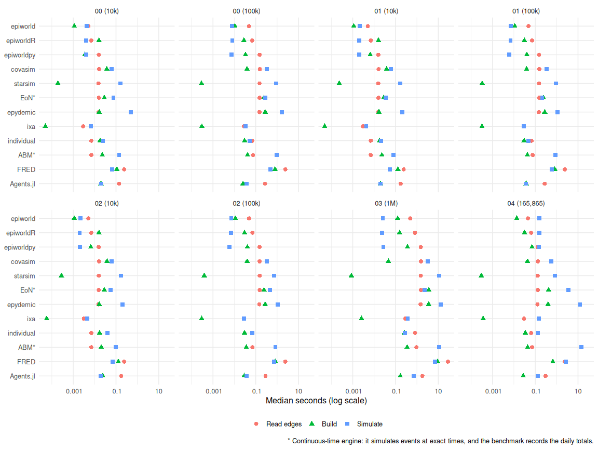
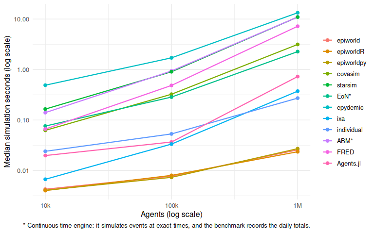
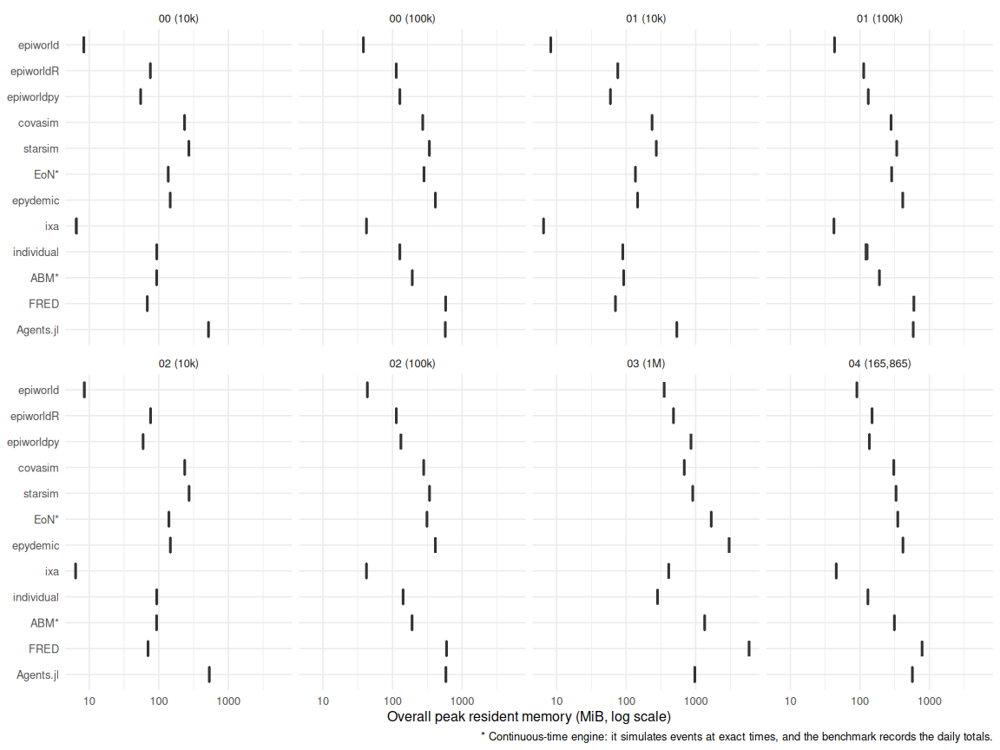

# Results

- [Run time](#run-time)
  - [Where the time goes](#where-the-time-goes)
  - [The language layer](#the-language-layer)
  - [Why the two fastest engines
    differ](#why-the-two-fastest-engines-differ)
- [Scaling](#scaling)
- [Cost of added features](#cost-of-added-features)
- [Memory](#memory)
- [Epidemiological agreement](#epidemiological-agreement)
- [Sensitivity and validity](#sensitivity-and-validity)
- [Implementation size](#implementation-size)
- [Completion](#completion)

[Back to the project overview](../README.md) · [Methods](methods.md)

The results across every scenario, from `results/results.csv`. The
[methods](methods.md) define each measure; each scenario’s report has
its full tables, including interquartile ranges.

## Run time

### Where the time goes

The median time of each phase of a replicate: reading the shared edge
list, building what the engine reuses across replicates, and simulating,
which includes everything the engine redoes for each replicate (see
[Timing](methods.md#timing)). Panels are scenarios at each population
size.

Simulation time is the measure every report ranks engines by. Its median
in seconds, in every scenario and size:

| Engine | 00 (10k) | 00 (100k) | 01 (10k) | 01 (100k) | 02 (10k) | 02 (100k) | 03 (1M) | 04 (165,865) |
|:---|---:|---:|---:|---:|---:|---:|---:|---:|
| epiworld | 0.0043 | 0.0077 | 0.0022 | 0.0072 | 0.0021 | 0.0071 | 0.0257 | 0.1557 |
| epiworldR | 0.0040 | 0.0080 | 0.0020 | 0.0070 | 0.0020 | 0.0070 | 0.0235 | 0.1570 |
| epiworldpy | 0.0041 | 0.0073 | 0.0020 | 0.0060 | 0.0020 | 0.0060 | 0.0271 | 0.1516 |
| covasim | 0.0624 | 0.3241 | 0.0619 | 0.3337 | 0.0613 | 0.3338 | 3.1438 | 0.5624 |
| starsim | 0.1646 | 0.9049 | 0.1695 | 0.9081 | 0.1708 | 0.7146 | 10.9618 | 0.8220 |
| EoN\* | 0.0759 | 0.2848 | 0.0345 | 0.2110 | 0.0561 | 0.4501 | 2.2656 | 3.5340 |
| epydemic | 0.4895 | 1.7056 | 0.2033 | 1.0750 | 0.2029 | 1.0761 | 13.3329 | 12.5106 |
| ixa | 0.0067 | 0.0334 | 0.0043 | 0.0289 | 0.0045 | 0.0284 | 0.3728 | 0.1489 |
| individual | 0.0240 | 0.0530 | 0.0210 | 0.0490 | 0.0400 | 0.0700 | 0.2715 | 0.1355 |
| ABM\* | 0.1400 | 0.9365 | 0.0815 | 0.8680 | 0.0990 | 0.8270 | 10.9625 | 14.3255 |
| FRED | 0.0662 | 0.4846 | 0.0543 | 0.5873 | 0.0686 | 0.7056 | 7.2043 | 2.6578 |
| Agents.jl | 0.0198 | 0.0366 | 0.0197 | 0.0374 | 0.0192 | 0.0366 | 0.7266 | 0.1334 |

\* Continuous-time engine: it simulates events at exact times, and
the benchmark records the daily totals.

### The language layer

The three epiworld runners build the same model on the same C++ core.
The wrappers’ simulation time relative to the C++ runner, matched by
seed:

| Wrapper | 00 (10k) | 00 (100k) | 01 (10k) | 01 (100k) | 02 (10k) | 02 (100k) | 03 (1M) | 04 (165,865) |
|:---|---:|---:|---:|---:|---:|---:|---:|---:|
| epiworldpy | 0.95 | 0.95 | 0.94 | 0.83 | 0.91 | 0.84 | 1.06 | 0.97 |
| epiworldR | 1.05 | 1.05 | 0.95 | 0.96 | 0.97 | 0.93 | 0.91 | 1.00 |

In the simulation itself the language layer costs nothing measurable:
neither wrapper is ever more than 6% slower than the C++ runner, and
epiworldpy is often faster. Where the C++ runner is slowest, in
scenarios 01 and 02 at 100,000 agents, the cause is memory allocation in
the C++ runner, not the wrappers (see scenario 01’s report). Outside the
simulation the wrappers cost something: at 100,000 agents, building the
model takes the C++ runner 0.011 seconds, against 0.028 for epiworldR
and 0.033 for epiworldpy, which first convert the edge list into their
own types.

### Why the two fastest engines differ

In scenarios 00 to 02, epiworld and ixa are the two fastest engines, and
epiworld is faster per replicate: in scenario 00, ixa takes 1.6 and 4.3
times as long as the C++ runner at 10,000 and 100,000 agents. Both
engines’ daily work follows the outbreak, through push-based
transmission in epiworld (since 0.16.1, with the push/pull choice
revised in 0.17.1,
[UofUEpiBio/epiworld#281](https://github.com/UofUEpiBio/epiworld/pull/281)),
and their epidemic computations are close. The difference is what each
redoes per replicate. ixa’s `execute()` runs a context only once, so
every replicate rebuilds the population, network, and index, which grows
with the population. epiworld builds its model once and re-initializes
every agent at the start of every `run()`, about twenty times cheaper;
with a vaccine, it also clones the tool for every agent it protects.
Bookkeeping does not separate them: epiworld records its outputs in
every scenario, and ixa adds the same records in scenario 02 at little
cost. [The epiworld and ixa note](epiworld-ixa.md) measures each of
these.

The order changes elsewhere. At 1,000,000 agents (scenario 03),
individual is faster than ixa. On scenario 04’s network, Agents.jl,
individual, ixa, and the epiworld family finish within about 20% of each
other (0.13 to 0.16 seconds). Its outbreak infects 0.622 of the
population, against 0.060 in scenario 00 at 100,000 agents, so the
engines whose work follows the outbreak do far more of it.

ABM, the second continuous-time engine after EoN, takes 0.94 seconds in
scenario 00 at 100,000 agents and 11 seconds at 1,000,000. It is slowest
on scenario 04’s network, where the outbreak reaches most of the
population: 14 seconds. ABM asks an R function for an infectious agent’s
contacts, because it cannot load an edge list, which is a likely cost on
a network of that size, but the benchmark has not profiled it.

## Scaling

The scenario 00 model at 10,000 and 100,000 agents and, in scenario 03,
at 1,000,000, on the same kind of network. With 100 seed cases and the
same per-contact risk, the outbreak stays about the same size in
absolute terms, so an engine whose work follows the outbreak should
barely slow down, and one that touches every agent every day should slow
down about tenfold per decade.

From 100,000 to 1,000,000 agents:

- **The epiworld runners** grow by 3.3 (C++), 2.9 (epiworldR), and 3.7
  (epiworldpy) times. Their daily work follows the outbreak; what grows
  is `reset()`, which re-initializes every agent at the start of
  `run()`.
- **individual** grows by 5.1 times. Its infection process visits the
  infectious agents’ neighbours, but it also tabulates contacts and
  intersects bitsets over the whole population every day.
- **EoN** (8.0 times) and **epydemic** (7.8) follow the outbreak in
  their event handling, but set up state for every node, in Python, at
  the start of each run.
- **Covasim** (9.7 times) and **Starsim** (12.1) update every agent’s
  arrays every day, and Starsim also draws transmission on every edge,
  so they grow about as fast as the population.
- **ixa** grows by 11.2 times: its per-replicate rebuild of a million
  entities, five million edges, and the index is most of its time at
  this size.
- **FRED** grows by 14.9 times, faster than the population: it rebuilds
  its places, population, and network for every replicate.
- **Agents.jl** grows by 19.8 times. Its daily step visits only the
  infectious agents’ neighbours, but it loops over every agent to find
  them and counts the hospitalized agents over the whole population
  every day.

Building the model once from the edge list, which a user pays once per
network however many replicates follow, takes the C++ runner 0.13
seconds at 1,000,000 agents, several times one of its replicates, and
EoN and epydemic 3.6 and 3.6 seconds for their NetworkX graphs.

## Cost of added features

Scenario 01 adds a vaccine to scenario 00, and scenario 02 adds four
outputs to scenario 01. The median ratio of each replicate’s simulation
time to the one with the same engine, size, and seed in the simpler
scenario:

| Engine | Vaccine (01 / 00), 10k | Vaccine (01 / 00), 100k | Outputs (02 / 01), 10k | Outputs (02 / 01), 100k |
|:---|---:|---:|---:|---:|
| epiworld | 0.50 | 0.94 | 1.00 | 1.00 |
| epiworldR | 0.50 | 0.87 | 1.00 | 1.00 |
| epiworldpy | 0.50 | 0.81 | 1.00 | 1.00 |
| covasim | 0.99 | 1.03 | 1.00 | 1.00 |
| starsim | 1.04 | 1.00 | 1.01 | 0.79 |
| EoN\* | 0.45 | 0.75 | 1.63 | 2.15 |
| epydemic | 0.42 | 0.63 | 1.00 | 1.01 |
| ixa | 0.63 | 0.88 | 1.05 | 0.99 |
| individual | 0.88 | 0.92 | 1.90 | 1.43 |
| ABM\* | 0.57 | 0.95 | 1.22 | 0.96 |
| FRED | 0.81 | 1.21 | 1.26 | 1.20 |
| Agents.jl | 1.01 | 1.02 | 0.97 | 0.99 |

\* Continuous-time engine: it simulates events at exact times, and
the benchmark records the daily totals.

**The vaccine.** A ratio below one does not mean the vaccine is free.
The vaccine cuts the median attack rate from 0.385 to 0.115 at 10,000
agents and from 0.060 to 0.014 at 100,000, so engines whose work follows
the outbreak (EoN, epydemic, the epiworld family, and ixa) get faster
for that reason alone. Covasim’s vectorized daily update touches every
agent regardless, and Starsim draws transmission on every edge every
day, so their times barely move; individual sits in between. A ratio
above one means the feature itself is expensive.

**The outputs.** Both scenarios run the same epidemics, so a ratio above
one is the cost of recording the outputs during the run. The epiworld
family already records all four in every scenario, and Covasim keeps its
infection log in every run, so they pay nothing extra; most engines that
had to add recording absorbed it too. The exceptions are EoN, whose
`return_full_data=True` appends to every node’s status history in Python
at every event; individual, whose runner compares full-population
bitsets every day to count transitions; and FRED, which writes a line to
its health records for every exposure and state change. Reading the
outputs out of the engine after the run is not in these times; scenario
02’s report shows it.

## Memory

Overall peak resident memory of every replicate (see
[Memory](methods.md#memory)):

Median simulation memory, the extra memory one more replicate needs, in
MiB:

| Engine | 00 (10k) | 00 (100k) | 01 (10k) | 01 (100k) | 02 (10k) | 02 (100k) | 03 (1M) | 04 (165,865) |
|:---|---:|---:|---:|---:|---:|---:|---:|---:|
| epiworld | 2 | 4 | 2 | 12 | 2 | 12 | 29 | 54 |
| epiworldR | 0 | 0 | 0 | 0 | 0 | 0 | 0 | 36 |
| epiworldpy | 1 | 0 | 0 | 1 | 0 | 1 | 43 | 42 |
| covasim | 5 | 33 | 5 | 42 | 5 | 42 | 289 | 71 |
| starsim | 7 | 68 | 7 | 68 | 8 | 69 | 566 | 63 |
| EoN\* | 3 | 28 | 2 | 30 | 6 | 57 | 290 | 98 |
| epydemic | 16 | 160 | 16 | 160 | 16 | 160 | 1,643 | 167 |
| ixa | 3 | 32 | 3 | 32 | 3 | 32 | 330 | 37 |
| individual | 14 | 35 | 10 | 35 | 16 | 50 | 126 | 39 |
| ABM\* | 16 | 98 | 15 | 96 | 16 | 96 | 1,129 | 218 |
| FRED |  |  |  |  |  |  |  |  |
| Agents.jl | 0 | 2 | 0 | 2 | 0 | 2 | 8 | 10 |

\* Continuous-time engine: it simulates events at exact times, and
the benchmark records the daily totals.

At 1,000,000 agents, FRED peaks at 5,847 MiB, epydemic at 3,020, and EoN
at 1,671, against 352 for the C++ epiworld runner, 409 for ixa, and 282
for individual. At small sizes the runtime itself can dominate:
Agents.jl uses 483 MiB before it reads the edge list. At large sizes,
most of EoN’s memory is its NetworkX graph (model footprint), epydemic
adds about as much again during the run, and most of ixa’s and Starsim’s
is their per-replicate rebuild (simulation memory).

## Epidemiological agreement

Median final attack rate by engine, with each engine’s difference from
epiworldR’s in parentheses:

| Engine | 00 (10k) | 00 (100k) | 01 (10k) | 01 (100k) | 02 (10k) | 02 (100k) | 03 (1M) | 04 (165,865) |
|:---|---:|---:|---:|---:|---:|---:|---:|---:|
| epiworld | 0.385 (+0.000) | 0.060 (+0.000) | 0.119 (+0.004) | 0.014 (-0.000) | 0.119 (+0.004) | 0.014 (-0.000) | 0.006 (+0.000) | 0.622 (+0.000) |
| epiworldR | 0.385 | 0.060 | 0.115 | 0.014 | 0.115 | 0.014 | 0.006 | 0.622 |
| epiworldpy | 0.385 (+0.000) | 0.060 (+0.000) | 0.117 (+0.002) | 0.014 (-0.000) | 0.117 (+0.002) | 0.014 (-0.000) | 0.006 (+0.000) | 0.622 (+0.000) |
| covasim | 0.392 (+0.007) | 0.061 (+0.001) | 0.105 (-0.010) | 0.012 (-0.002) | 0.105 (-0.010) | 0.012 (-0.002) | 0.007 (+0.000) | 0.699 (+0.077) |
| starsim | 0.387 (+0.002) | 0.059 (-0.000) | 0.119 (+0.004) | 0.014 (-0.000) | 0.119 (+0.004) | 0.014 (-0.000) | 0.007 (+0.001) | 0.612 (-0.010) |
| EoN\* | 0.379 (-0.007) | 0.060 (-0.000) | 0.113 (-0.002) | 0.013 (-0.001) | 0.113 (-0.002) | 0.013 (-0.001) | 0.007 (+0.001) | 0.620 (-0.002) |
| epydemic | 0.396 (+0.010) | 0.064 (+0.004) | 0.121 (+0.006) | 0.014 (-0.000) | 0.121 (+0.006) | 0.014 (-0.000) | 0.007 (+0.001) | 0.623 (+0.001) |
| ixa | 0.378 (-0.007) | 0.062 (+0.002) | 0.119 (+0.004) | 0.014 (-0.000) | 0.119 (+0.004) | 0.014 (-0.000) | 0.006 (+0.000) | 0.625 (+0.002) |
| individual | 0.381 (-0.005) | 0.060 (+0.000) | 0.117 (+0.002) | 0.013 (-0.001) | 0.116 (+0.001) | 0.013 (-0.001) | 0.006 (+0.000) | 0.630 (+0.008) |
| ABM\* | 0.383 (-0.003) | 0.059 (-0.001) | 0.114 (-0.001) | 0.013 (-0.001) | 0.114 (-0.001) | 0.013 (-0.001) | 0.006 (+0.000) | 0.620 (-0.002) |
| FRED | 0.385 (-0.000) | 0.060 (-0.000) | 0.115 (-0.000) | 0.012 (-0.002) | 0.115 (-0.000) | 0.012 (-0.002) | 0.006 (+0.000) | 0.631 (+0.009) |
| Agents.jl | 0.387 (+0.001) | 0.062 (+0.002) | 0.118 (+0.003) | 0.014 (-0.000) | 0.118 (+0.003) | 0.014 (-0.000) | 0.007 (+0.001) | 0.624 (+0.002) |

\* Continuous-time engine: it simulates events at exact times, and
the benchmark records the daily totals.

In scenarios 00 to 03, every engine’s median stays within about 0.01 of
epiworldR’s. Scenario 04 is uncalibrated (see its report): Covasim sits
0.077 above, and every other engine within about 0.01. Each report also
shows the peak hospitalization load, and scenario 02’s checks every
engine’s outputs against its own final counts.

## Sensitivity and validity

- **Outbreak size.** Run time depends on the epidemic as well as on the
  population: the vaccine (scenario 01) shrinks the outbreak and speeds
  up the engines whose work follows it, scenario 03 grows the population
  ten times with an outbreak that hardly grows, and scenario 04’s
  outbreak reaches most of its population. Ranking engines by one
  scenario alone would mislead.
- **Concurrency.** Running replicates side by side changes timings
  unevenly across engines, so every published run is sequential
  ([Execution protocol](methods.md#execution-protocol)).
- **Environment.** Every scenario’s replicates ran in one recorded
  environment ([Environment](methods.md#environment)); a report warns
  when its replicates mix environments.
- **Validity checks.** Every runner checks that its five compartments
  sum to the population, and scenario 02 checks the outputs against the
  final counts in every run.
- **Not yet covered.** An alternate transmission intensity or outbreak
  size, and prespecified equivalence thresholds for the epidemiological
  outcomes
  ([\#10](https://github.com/UofUEpiBio/epiworld-benchmark/issues/10)).

## Implementation size

Model lines of every engine in every scenario (see [Implementation
size](methods.md#implementation-size)). Scenarios 03 and 04 reuse
scenario 00’s runners.

| Engine     | Language |  00 |  01 |  02 |  03 |  04 |
|:-----------|:---------|----:|----:|----:|----:|----:|
| epiworld   | C++      |  26 |  34 |  57 |  26 |  26 |
| epiworldR  | R        |  47 |  62 |  66 |  47 |  47 |
| epiworldpy | Python   |  35 |  39 |  53 |  35 |  35 |
| covasim    | Python   |  65 |  76 | 110 |  65 |  65 |
| starsim    | Python   |  84 |  95 | 137 |  84 |  84 |
| EoN\*      | Python   |  38 |  45 |  77 |  38 |  38 |
| epydemic   | Python   |  71 |  89 | 122 |  71 |  71 |
| ixa        | Rust     | 138 | 168 | 220 | 138 | 138 |
| individual | R        |  32 |  37 |  80 |  32 |  32 |
| ABM\*      | R        |  42 |  45 |  59 |  42 |  42 |
| FRED       | Python   |  92 | 123 | 165 |  92 |  92 |
| Agents.jl  | Julia    |  68 |  83 | 115 |  68 |  68 |

\* Continuous-time engine: it simulates events at exact times, and
the benchmark records the daily totals.

## Completion

Completed replicates against each scenario’s design, and the failures
each scenario’s latest run recorded. Every engine expresses and
completes every scenario.

| Engine                  |    00 |    01 |    02 |   03 |   04 |
|:------------------------|------:|------:|------:|-----:|-----:|
| epiworld                | ✓ 200 | ✓ 200 | ✓ 200 | ✓ 20 | ✓ 20 |
| epiworldR               | ✓ 200 | ✓ 200 | ✓ 200 | ✓ 20 | ✓ 20 |
| epiworldpy              | ✓ 200 | ✓ 200 | ✓ 200 | ✓ 20 | ✓ 20 |
| covasim                 | ✓ 200 | ✓ 200 | ✓ 200 | ✓ 20 | ✓ 20 |
| starsim                 | ✓ 200 | ✓ 200 | ✓ 200 | ✓ 20 | ✓ 20 |
| EoN\*                   | ✓ 200 | ✓ 200 | ✓ 200 | ✓ 20 | ✓ 20 |
| epydemic                | ✓ 200 | ✓ 200 | ✓ 200 | ✓ 20 | ✓ 20 |
| ixa                     | ✓ 200 | ✓ 200 | ✓ 200 | ✓ 20 | ✓ 20 |
| individual              | ✓ 200 | ✓ 200 | ✓ 200 | ✓ 20 | ✓ 20 |
| ABM\*                   | ✓ 200 | ✓ 200 | ✓ 200 | ✓ 20 | ✓ 20 |
| FRED                    | ✓ 200 | ✓ 200 | ✓ 200 | ✓ 20 | ✓ 20 |
| Agents.jl               | ✓ 200 | ✓ 200 | ✓ 200 | ✓ 20 | ✓ 20 |
| Failed runs, latest run |     0 |     0 |     0 |    0 |    0 |

\* Continuous-time engine: it simulates events at exact times, and
the benchmark records the daily totals.
