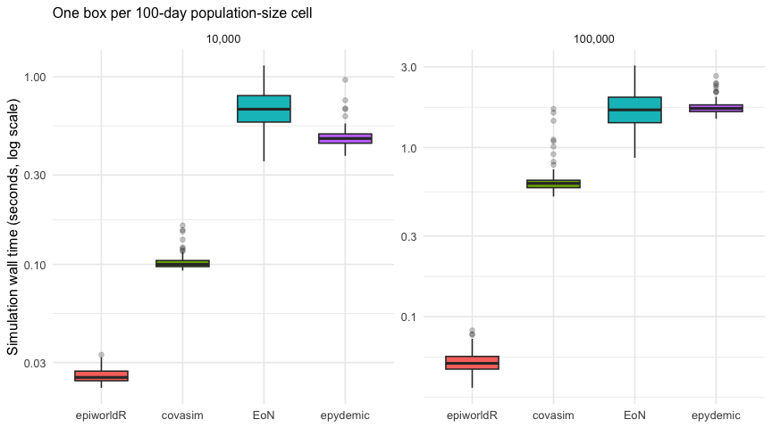
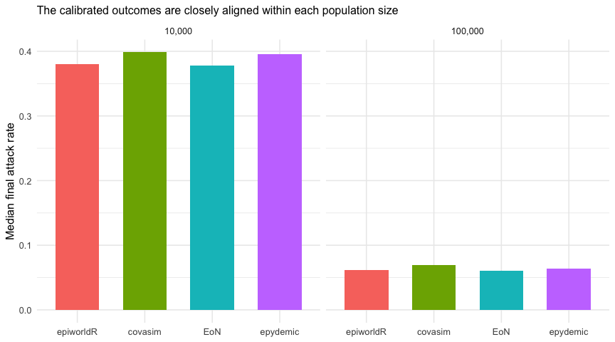

# Network epidemic ABM speed benchmark

2026-09-08

- [Executive summary](#executive-summary)
- [Simulation time](#simulation-time)
- [Speed relative to epiworldR](#speed-relative-to-epiworldr)
- [Epidemiological sanity checks](#epidemiological-sanity-checks)
- [Design and interpretation](#design-and-interpretation)
- [Reproducibility and cache](#reproducibility-and-cache)

## Executive summary

This benchmark compares simulation speed for 100-day network epidemics
at 10,000 and 100,000 agents, with 100 independent replicates per engine
and size. All engines use the exact same cached Watts–Strogatz edge list
for a population size (mean degree 10, rewiring probability 0.05) and
target an early-outbreak $R_0 = 2$. The epiworldR cells apply documented
size-specific transmission multipliers of 0.887 at 10,000 agents and
0.855 at 100,000 agents to correct their higher realized attack rates
under the framework’s discrete-time transition semantics.

> [!TIP]
>
> The complete 800-run design is available.

| Field               | Value                        |
|:--------------------|:-----------------------------|
| Platform            | macOS-15.0.1-arm64-arm-64bit |
| Python              | 3.12.11                      |
| Workers             | 1                            |
| Latest run failures | 0                            |

| Engine    | Agents | Runs | Median simulation (s) | Q1 (s) | Q3 (s) |
|:----------|-------:|-----:|----------------------:|-------:|-------:|
| epiworldR |  10000 |  100 |                 0.025 |  0.024 |  0.027 |
| covasim   |  10000 |  100 |                 0.100 |  0.097 |  0.105 |
| epydemic  |  10000 |  100 |                 0.469 |  0.443 |  0.496 |
| EoN       |  10000 |  100 |                 0.672 |  0.574 |  0.794 |
| epiworldR | 100000 |  100 |                 0.053 |  0.049 |  0.058 |
| covasim   | 100000 |  100 |                 0.614 |  0.579 |  0.641 |
| EoN       | 100000 |  100 |                 1.670 |  1.402 |  1.984 |
| epydemic  | 100000 |  100 |                 1.703 |  1.631 |  1.787 |

## Simulation time

The primary measure is wall-clock time inside each engine’s simulation
call. The logarithmic scale keeps fast and slow engines legible in one
panel.

## Speed relative to epiworldR

Ratios are matched by population size and replicate seed. Values above
one mean that epiworldR completed the simulation call faster.

| Engine   | Agents | Median time / epiworldR |    Q1 |    Q3 |
|:---------|-------:|------------------------:|------:|------:|
| covasim  |  10000 |                    3.99 |  3.69 |  4.26 |
| EoN      |  10000 |                   26.07 | 22.18 | 31.22 |
| epydemic |  10000 |                   18.65 | 16.98 | 19.93 |
| covasim  | 100000 |                   11.40 | 10.39 | 12.87 |
| EoN      | 100000 |                   30.82 | 25.21 | 38.98 |
| epydemic | 100000 |                   32.36 | 29.23 | 35.92 |

## Epidemiological sanity checks

Speed is interpretable only if the simulations produce plausible
epidemics. These checks show final attack rate and peak hospitalization
load; differences also expose the engines’ non-identical time semantics
and Covasim’s richer native progression.

| Engine    | Agents | Median final attack rate | Median peak hospitalized |
|:----------|-------:|-------------------------:|-------------------------:|
| epiworldR |  10000 |                    0.380 |                     22.0 |
| covasim   |  10000 |                    0.398 |                     25.0 |
| EoN       |  10000 |                    0.377 |                     22.0 |
| epydemic  |  10000 |                    0.396 |                     25.0 |
| epiworldR | 100000 |                    0.062 |                     28.0 |
| covasim   | 100000 |                    0.069 |                     40.5 |
| EoN       | 100000 |                    0.061 |                     34.0 |
| epydemic  | 100000 |                    0.064 |                     41.0 |

## Design and interpretation

The common disease graph is susceptible $\rightarrow$ exposed
$\rightarrow$ infectious $\rightarrow$ recovered, with a competing
infectious $\rightarrow$ hospitalized $\rightarrow$ recovered branch.
Mean latent and infectious periods are 4 and 7 days, lifetime
hospitalization probability is 5%, and the hospital stay is 7 days.
Initial infections are 100 in the full profile.

The initial analytic transmission mapping produced larger attack rates
in epiworldR than in the other engines. Short pilot calibrations
therefore selected multipliers of 0.887 at 10,000 agents and 0.855 at
100,000 agents, after which all 100 epiworldR replicates in each
adjusted cell were rerun. The resulting median attack rates are shown
above. These empirical corrections are intentionally
population-specific; they align the benchmark outcomes but mean that the
epiworldR cells no longer have a strictly analytic $R_0$ of 2. The
values live in `config.toml` and participate in the cache fingerprint.

epiworldR and epydemic use synchronous daily transitions. EoN uses
continuous-time Gillespie hazards. Covasim retains its native exposed,
infectious, symptomatic, and severe bookkeeping, with severe prevalence
used as the hospitalization proxy. Thus this report measures
representative framework throughput under aligned network and disease
targets; it does not claim bit-for-bit epidemiological equivalence.

The sparse contact network fixes mean degree rather than literal graph
density. At 10,000 and 100,000 agents its densities are approximately
0.001 and 0.0001, respectively, while every agent still has about ten
contacts. This prevents the edge count, runtime, and memory from growing
quadratically.

## Reproducibility and cache

Every successful replicate is an atomic JSON cache record keyed by model
configuration, runner source, engine version, and contact-network
SHA-256. Rerunning `make benchmark` schedules only missing or stale
records. The default worker count is one, and common native math-library
thread counts are pinned to one; users must explicitly opt into a second
worker.

| Engine    | Recorded version |
|:----------|:-----------------|
| covasim   | 3.1.8            |
| EoN       | 1.92             |
| epiworldR | 0.15.1.0         |
| epydemic  | 1.14.1           |
