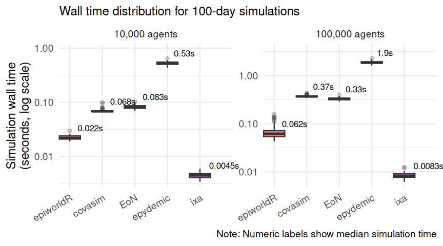
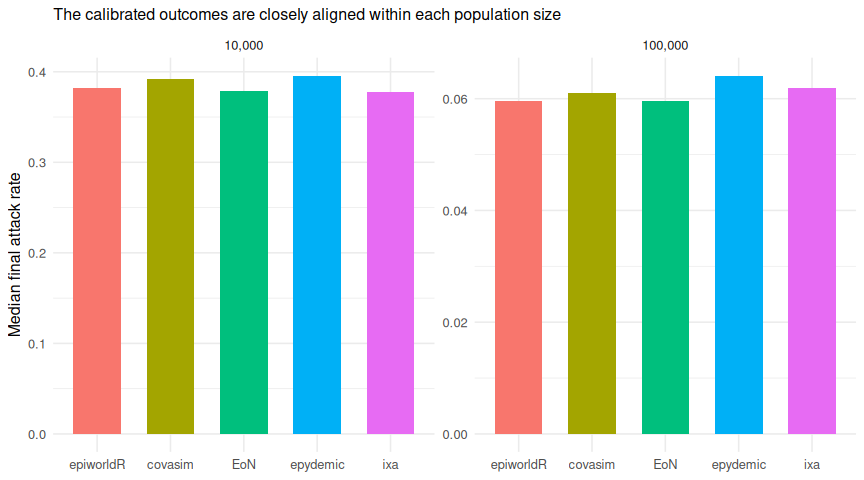

# Scenario 00: SEIRH baseline

2026-09-23

- [Model](#model)
  - [Engine implementations](#engine-implementations)
- [Results](#results)
  - [Simulation time](#simulation-time)
  - [Speed relative to epiworldR](#speed-relative-to-epiworldr)
  - [Epidemiological sanity checks](#epidemiological-sanity-checks)
  - [Code required to define the
    model](#code-required-to-define-the-model)
- [Interpretation](#interpretation)
  - [Calibration](#calibration)
  - [Why the two fastest engines
    differ](#why-the-two-fastest-engines-differ)
  - [Equivalence across engines](#equivalence-across-engines)
- [Recorded versions](#recorded-versions)

[Back to the project overview](../README.md)

The reference model for the benchmark. Every later scenario adds
complexity to it, and each later scenario’s report compares its run time
and model code against this one.

## Model

Susceptible $\rightarrow$ exposed $\rightarrow$ infectious $\rightarrow$
recovered, with a competing infectious $\rightarrow$ hospitalized
$\rightarrow$ recovered branch. Transmission happens along the shared
Watts–Strogatz contact network (mean degree 10, rewiring probability
0.05). There are no interventions.

| Parameter (`scenario.toml`) | Value | Meaning |
|:---|---:|:---|
| `target_r0` | 2.0 | Early-outbreak $R_0$ used by the analytic mapping |
| `initial_infected` | 100 | Seed cases (10 in the smoke profile) |
| `latent_days` | 4.0 | Mean exposed period |
| `infectious_days` | 7.0 | Mean infectious period |
| `hospitalization_probability` | 0.05 | Lifetime probability that an infectious agent is hospitalized |
| `hospital_days` | 7.0 | Mean hospital stay |

Initial cases start infectious in every engine except epiworldR. Its R
API cannot seed a custom model’s initial cases in any state other than
the one new infections enter, so they start exposed there.

### Engine implementations

- **epiworldR**: a custom model built from `add_state()` and the
  package’s update-function factories. New infections enter Exposed.
- **Covasim**: native disease progression restricted to SEIRH. Waning is
  off, and individual transmissibility and viral load are fixed. The
  severe state serves as the hospitalization proxy.
- **EoN**: a continuous-time rate graph run with its event-driven
  `fast_simple_contagion` algorithm.
- **epydemic**: a `CompartmentedModel` under `SynchronousDynamics`.
- **ixa**: one plan per day, ixa’s built-in contact network, and an
  indexed disease-status property. The competing infectious transitions
  reuse epiworldR’s roulette rule.

## Results

> [!TIP]
>
> The complete 1,000-run design for this scenario is available.

| Field               | Value                                                 |
|:--------------------|:------------------------------------------------------|
| Platform            | Linux-6.12.13-200.fc41.aarch64-aarch64-with-glibc2.39 |
| Python              | 3.12.11                                               |
| Workers             | 1                                                     |
| Latest run failures | 0                                                     |

| Engine    | Agents | Runs | Median simulation (s) | Q1 (s) | Q3 (s) |
|:----------|-------:|-----:|----------------------:|-------:|-------:|
| ixa       |  10000 |  100 |                 0.004 |  0.004 |  0.005 |
| epiworldR |  10000 |  100 |                 0.022 |  0.021 |  0.024 |
| covasim   |  10000 |  100 |                 0.068 |  0.067 |  0.070 |
| EoN       |  10000 |  100 |                 0.083 |  0.078 |  0.087 |
| epydemic  |  10000 |  100 |                 0.526 |  0.502 |  0.552 |
| ixa       | 100000 |  100 |                 0.008 |  0.008 |  0.009 |
| epiworldR | 100000 |  100 |                 0.062 |  0.054 |  0.072 |
| EoN       | 100000 |  100 |                 0.327 |  0.316 |  0.342 |
| covasim   | 100000 |  100 |                 0.369 |  0.363 |  0.378 |
| epydemic  | 100000 |  100 |                 1.867 |  1.808 |  1.953 |

### Simulation time

The primary measure is wall-clock time inside each engine’s simulation
call. The logarithmic scale keeps fast and slow engines legible in one
panel.

### Speed relative to epiworldR

Ratios are matched by population size and replicate seed. Values above
one mean that epiworldR completed the simulation call faster.

| Engine   | Agents | Median time / epiworldR |    Q1 |    Q3 |
|:---------|-------:|------------------------:|------:|------:|
| covasim  |  10000 |                    3.12 |  2.89 |  3.29 |
| EoN      |  10000 |                    3.69 |  3.41 |  4.06 |
| epydemic |  10000 |                   24.08 | 22.49 | 25.04 |
| ixa      |  10000 |                    0.21 |  0.18 |  0.22 |
| covasim  | 100000 |                    6.00 |  5.11 |  6.94 |
| EoN      | 100000 |                    5.38 |  4.58 |  6.18 |
| epydemic | 100000 |                   30.31 | 25.47 | 35.22 |
| ixa      | 100000 |                    0.13 |  0.11 |  0.15 |

### Epidemiological sanity checks

Speed is interpretable only if the simulations produce plausible
epidemics. These checks show the final attack rate and peak
hospitalization load. Differences also expose the engines’ non-identical
time semantics and Covasim’s native symptom/severe bookkeeping.

| Engine    | Agents | Median final attack rate | Median peak hospitalized |
|:----------|-------:|-------------------------:|-------------------------:|
| covasim   |  10000 |                    0.392 |                     23.0 |
| EoN       |  10000 |                    0.379 |                     21.0 |
| epiworldR |  10000 |                    0.382 |                     19.0 |
| epydemic  |  10000 |                    0.396 |                     25.0 |
| ixa       |  10000 |                    0.378 |                     18.5 |
| covasim   | 100000 |                    0.061 |                     35.0 |
| EoN       | 100000 |                    0.060 |                     32.0 |
| epiworldR | 100000 |                    0.060 |                     30.0 |
| epydemic  | 100000 |                    0.064 |                     41.0 |
| ixa       | 100000 |                    0.062 |                     31.0 |

### Code required to define the model

A rough measure of effort: how much code each engine needs to express
the model. The counting rules are described in the [project
overview](../README.md#measuring-implementation-effort), and the counted
regions are listed in [`code_regions.yml`](code_regions.yml).

| Engine    | Language | Files | Model lines |
|:----------|:---------|------:|------------:|
| EoN       | Python   |     1 |          37 |
| epiworldR | R        |     1 |          47 |
| covasim   | Python   |     1 |          64 |
| epydemic  | Python   |     1 |          70 |
| ixa       | Rust     |     3 |         133 |

Model lines vary with how much of the model an engine provides built in.
For example, EoN describes transitions as rate graphs, Covasim needs its
native parameters overridden to restrict it to SEIRH, and the ixa runner
writes its daily step by hand. The Python engines share one runner file,
and ixa needs a Cargo project that is compiled before it runs.

## Interpretation

### Calibration

The shared analytic transmission mapping produced different realized
attack rates across frameworks. Calibration therefore selected
size-specific factors for restricted Covasim (0.715 at 10,000 agents and
0.710 at 100,000) and for ixa (0.983 and 0.988). epiworldR needs none:
its uncalibrated median attack rates match EoN’s exact continuous-time
results. All 100 replicates in each adjusted cell were then rerun. These
empirical corrections are intentionally population-specific; they align
benchmark outcomes but mean that none of the calibrated engines has a
strictly analytic $R_0$ of 2. The values live in
[`scenario.toml`](scenario.toml) and participate in the cache
fingerprint.

Covasim’s factors were calibrated after restricting it to fixed
transmission and permanent immunity. ixa shares the synchronous daily
semantics of epiworldR and epydemic, but its uncalibrated attack rates
sat above the other engines: it seeds the initial cases as infectious
and samples each infectious contact independently rather than with
epiworld’s roulette.

### Why the two fastest engines differ

ixa’s step visits only exposed, infectious, and hospitalized agents,
found through its indexed status property, and tries transmission
outward from each infectious agent to its susceptible neighbours, so its
cost follows the size of the outbreak. epiworldR’s queuing system skips
agents with no infected contact, but each queued susceptible agent
(every neighbour of an exposed, infectious, or hospitalized agent) scans
all of its neighbours for infectious ones, which is roughly ten times as
many neighbour visits. Its daily loop also checks every agent’s queue
flag, about 12% of its run time at 100,000 agents. An exact push-style
alternative for epiworld is proposed in
[UofUEpiBio/epiworld#264](https://github.com/UofUEpiBio/epiworld/issues/264).

### Equivalence across engines

epiworldR, epydemic, and ixa use synchronous daily transitions, while
EoN uses continuous-time hazards, simulated exactly. Covasim retains its
native exposed, infectious, symptomatic, and severe bookkeeping, with
severe prevalence used as the hospitalization proxy. Its runner disables
waning immunity and fixes individual transmissibility and viral load to
one, making recovered people permanently removed and removing those
sources of heterogeneity. Covasim does not expose a public switch to
remove the remaining symptom/severity bookkeeping. Thus this report
measures restricted, representative framework throughput under aligned
network and disease targets; it does not claim bit-for-bit
epidemiological equivalence.

## Recorded versions

| Engine    | Recorded version |
|:----------|:-----------------|
| covasim   | 3.1.8            |
| EoN       | 1.92             |
| epiworldR | 0.15.1.0         |
| epydemic  | 1.14.1           |
| ixa       | 3.1.0            |
