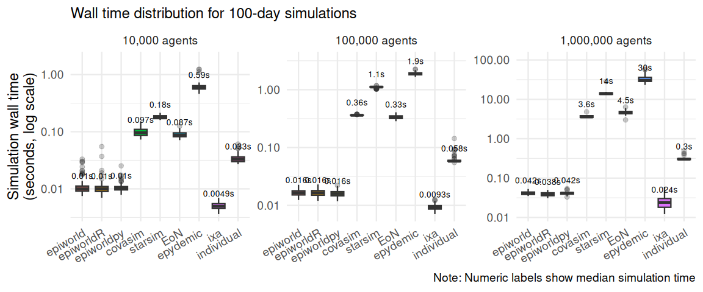
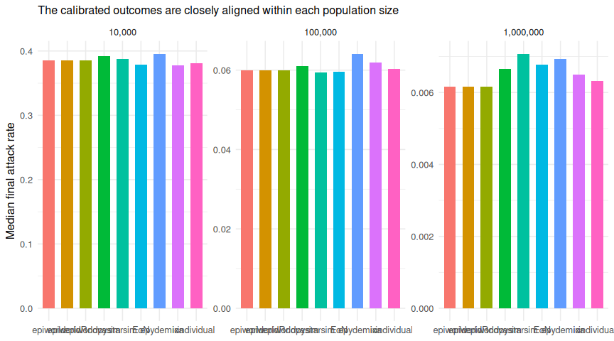

# Scenario 00: SEIRH baseline

2026-09-29

- [Model](#model)
  - [Engine implementations](#engine-implementations)
- [Results](#results)
  - [Simulation time](#simulation-time)
  - [Speed relative to epiworldR](#speed-relative-to-epiworldr)
  - [Time to a first result](#time-to-a-first-result)
  - [The epiworld family](#the-epiworld-family)
  - [Epidemiological sanity checks](#epidemiological-sanity-checks)
  - [Code required to define the
    model](#code-required-to-define-the-model)
- [Interpretation](#interpretation)
  - [Calibration](#calibration)
  - [The language layer costs nothing measurable in the
    simulation](#the-language-layer-costs-nothing-measurable-in-the-simulation)
  - [Why the two fastest engines
    differ](#why-the-two-fastest-engines-differ)
  - [Equivalence across engines](#equivalence-across-engines)
- [Recorded versions](#recorded-versions)

[Back to the project overview](../README.md)

The reference model for the benchmark. Every later scenario adds
complexity to it, and each later scenario’s report compares its run time
and model code against this one.

## Model

Susceptible $\rightarrow$ exposed $\rightarrow$ infectious $\rightarrow$
recovered, with a competing infectious $\rightarrow$ hospitalized
$\rightarrow$ recovered branch. Transmission happens along the shared
Watts–Strogatz contact network (mean degree 10, rewiring probability
0.05). There are no interventions.

| Parameter (`scenario.toml`) | Value | Meaning |
|:---|---:|:---|
| `target_r0` | 2.0 | Early-outbreak $R_0$ used by the analytic mapping |
| `initial_infected` | 100 | Seed cases (10 in the smoke profile) |
| `latent_days` | 4.0 | Mean exposed period |
| `infectious_days` | 7.0 | Mean infectious period |
| `hospitalization_probability` | 0.05 | Lifetime probability that an infectious agent is hospitalized |
| `hospital_days` | 7.0 | Mean hospital stay |

Initial cases start infectious in every engine except the epiworld
family and Starsim. epiworldR’s API cannot seed a custom model’s initial
cases in any state other than the one new infections enter, so they
start exposed there. The C++ and Python runners do the same, so that all
three epiworld runners build exactly the same model. Starsim’s SEIR puts
its seed cases where new infections go, which is also exposed.

The simulation time covers everything an engine has to redo for another
replicate on the same network (see [what is
measured](../README.md#run-time)). Seeding the initial cases is part of
it in every runner, because the seeds differ in every run and epiworld
places them inside `run()`, which also re-initializes the whole
population. EoN’s timer covers building its initial status dictionary,
individual’s covers building its state variable, and the other engines
seed inside their simulation call. ixa’s `execute()` runs a context only
once, so its timer also covers building the context: the population, the
network, and the index on disease status; it then seeds in a plan at
time 0. Starsim’s `Sim` also runs only once, so its timer covers
building the disease, network, and `Sim` objects and `sim.init()`, which
builds the agent and network arrays and seeds the initial cases.

[Scenario 03](../scenario_03/README.md) runs this model at 1,000,000
agents.

### Engine implementations

- **epiworld** (C++): a custom model built from `add_state()` and the
  library’s update-function factories,
  `sampler::make_update_susceptible()` and
  `new_state_update_transition()`. New infections enter Exposed. It is
  compiled with the flags R uses for epiworldR (`-O2 -DNDEBUG`, double
  precision).
- **epiworldR**: the same model through the R wrapper, with
  `update_fun_susceptible()` and `update_fun_rate()`.
- **epiworldpy**: the same model through the Python wrapper, with
  `UpdateFun.susceptible()` and `UpdateFun.rate()`. These were added for
  this benchmark in
  [UofUEpiBio/epiworldpy#17](https://github.com/UofUEpiBio/epiworldpy/pull/17).
  Before, a custom model’s other states needed Python callbacks, which
  epiworld calls for every agent every day. epiworldpy compiles epiworld
  with its default single-precision `float`, and with the same seed it
  still gives the same epidemics as the other two.
- **Covasim**: native disease progression restricted to SEIRH. Waning is
  off, and individual transmissibility and viral load are fixed. The
  severe state serves as the hospitalization proxy.
- **Starsim**: its built-in `ss.SEIR` disease, subclassed to add a
  hospital state, on a network module holding the shared edge list.
  Transmission is Starsim’s own per-edge, per-day draw with a daily
  probability (`ss.probperday`). Durations are sampled when an agent
  enters a state: exponential latent, infectious, and hospital periods,
  with hospitalization decided by a Bernoulli draw with the lifetime
  probability.
- **EoN**: a continuous-time rate graph run with its event-driven
  `fast_simple_contagion` algorithm.
- **epydemic**: a `CompartmentedModel` under `SynchronousDynamics`.
- **ixa**: one plan per day, ixa’s built-in contact network, and an
  indexed disease-status property. The competing infectious transitions
  reuse epiworldR’s roulette rule.
- **individual**: a `CategoricalVariable` for the disease state, the
  built-in `bernoulli_process()` for E $\rightarrow$ I and H
  $\rightarrow$ R, and `fixed_probability_multinomial_process()` for
  leaving I, to H with the lifetime hospitalization probability and
  otherwise to R. individual has no contact networks, so infection is a
  process written for this benchmark over an adjacency list built from
  the edge list: a susceptible agent with $k$ infectious neighbours is
  infected with probability $1 - (1 - \beta)^k$, as in epiworld. Updates
  queued during a day apply at its end, so the steps are synchronous.

## Results

> [!TIP]
>
> The complete 1,800-run design for this scenario is available.

| Field               | Value                                                 |
|:--------------------|:------------------------------------------------------|
| Platform            | Linux-6.12.13-200.fc41.aarch64-aarch64-with-glibc2.39 |
| Python              | 3.12.11                                               |
| Workers             | 1                                                     |
| Latest run failures | 0                                                     |

| Engine     | Agents | Runs | Median simulation (s) | Q1 (s) | Q3 (s) |
|:-----------|-------:|-----:|----------------------:|-------:|-------:|
| epiworldpy |  10000 |  100 |                 0.004 |  0.004 |  0.005 |
| epiworld   |  10000 |  100 |                 0.005 |  0.004 |  0.005 |
| epiworldR  |  10000 |  100 |                 0.005 |  0.004 |  0.005 |
| ixa        |  10000 |  100 |                 0.007 |  0.007 |  0.008 |
| individual |  10000 |  100 |                 0.026 |  0.025 |  0.027 |
| covasim    |  10000 |  100 |                 0.065 |  0.064 |  0.067 |
| EoN        |  10000 |  100 |                 0.079 |  0.074 |  0.085 |
| starsim    |  10000 |  100 |                 0.174 |  0.169 |  0.182 |
| epydemic   |  10000 |  100 |                 0.509 |  0.483 |  0.552 |
| epiworldpy | 100000 |  100 |                 0.008 |  0.007 |  0.008 |
| epiworldR  | 100000 |  100 |                 0.008 |  0.008 |  0.009 |
| epiworld   | 100000 |  100 |                 0.008 |  0.008 |  0.009 |
| ixa        | 100000 |  100 |                 0.038 |  0.035 |  0.045 |
| individual | 100000 |  100 |                 0.060 |  0.056 |  0.070 |
| EoN        | 100000 |  100 |                 0.306 |  0.293 |  0.329 |
| covasim    | 100000 |  100 |                 0.329 |  0.324 |  0.348 |
| starsim    | 100000 |  100 |                 0.938 |  0.907 |  0.998 |
| epydemic   | 100000 |  100 |                 1.854 |  1.747 |  1.974 |

### Simulation time

The primary measure is wall-clock time inside each engine’s simulation
call. The logarithmic scale keeps fast and slow engines legible in one
panel.

### Speed relative to epiworldR

Ratios are matched by population size and replicate seed. Values above
one mean that epiworldR completed the simulation call faster.

| Engine     | Agents | Median time / epiworldR |     Q1 |     Q3 |
|:-----------|-------:|------------------------:|-------:|-------:|
| epiworld   |  10000 |                    1.06 |   0.98 |   1.15 |
| epiworldpy |  10000 |                    0.94 |   0.86 |   1.01 |
| covasim    |  10000 |                   14.14 |  13.00 |  16.14 |
| starsim    |  10000 |                   41.32 |  34.47 |  43.54 |
| EoN        |  10000 |                   17.47 |  15.52 |  19.77 |
| epydemic   |  10000 |                  114.16 | 101.23 | 126.36 |
| ixa        |  10000 |                    1.60 |   1.43 |   1.76 |
| individual |  10000 |                    5.70 |   5.20 |   6.50 |
| epiworld   | 100000 |                    0.98 |   0.93 |   1.04 |
| epiworldpy | 100000 |                    0.88 |   0.84 |   0.92 |
| covasim    | 100000 |                   40.23 |  36.09 |  42.65 |
| starsim    | 100000 |                  113.54 | 100.25 | 125.77 |
| EoN        | 100000 |                   36.67 |  32.41 |  41.96 |
| epydemic   | 100000 |                  217.21 | 193.98 | 244.79 |
| ixa        | 100000 |                    4.68 |   4.19 |   5.18 |
| individual | 100000 |                    7.31 |   6.54 |   8.62 |

### Time to a first result

The simulation time above covers what an engine has to redo for every
replicate on the same network (see [what is
measured](../README.md#run-time)). *Build* is the rest of the setup:
turning the edge list into the engine’s population and network, which a
user does once per network. *Build + simulate* is the time to a first
result once the edge list is in memory. Reading the edge file is shown
but left out of it, because its cost depends on each language’s file
parsing rather than on the engine.

| Engine     | Agents | Read edges (s) | Build (s) | Simulate (s) | Build + simulate (s) |
|:-----------|-------:|---------------:|----------:|-------------:|---------------------:|
| epiworld   |  10000 |          0.005 |     0.001 |        0.005 |                0.006 |
| ixa        |  10000 |          0.003 |     0.000 |        0.007 |                0.007 |
| epiworldpy |  10000 |          0.017 |     0.004 |        0.004 |                0.008 |
| epiworldR  |  10000 |          0.008 |     0.013 |        0.005 |                0.017 |
| individual |  10000 |          0.008 |     0.015 |        0.026 |                0.041 |
| covasim    |  10000 |          0.017 |     0.041 |        0.065 |                0.106 |
| EoN        |  10000 |          0.017 |     0.032 |        0.079 |                0.110 |
| starsim    |  10000 |          0.017 |     0.000 |        0.174 |                0.174 |
| epydemic   |  10000 |          0.017 |     0.018 |        0.509 |                0.529 |
| epiworld   | 100000 |          0.049 |     0.011 |        0.008 |                0.020 |
| epiworldR  | 100000 |          0.070 |     0.027 |        0.008 |                0.036 |
| ixa        | 100000 |          0.029 |     0.000 |        0.038 |                0.039 |
| epiworldpy | 100000 |          0.155 |     0.036 |        0.008 |                0.044 |
| individual | 100000 |          0.072 |     0.031 |        0.060 |                0.090 |
| covasim    | 100000 |          0.153 |     0.041 |        0.329 |                0.372 |
| EoN        | 100000 |          0.161 |     0.274 |        0.306 |                0.587 |
| starsim    | 100000 |          0.152 |     0.000 |        0.938 |                0.938 |
| epydemic   | 100000 |          0.156 |     0.312 |        1.854 |                2.160 |

### The epiworld family

The three epiworld runners build the same model on the same C++ core,
and in this scenario they produce identical epidemics for every seed.
This table compares the two wrappers with the C++ runner, replicate by
replicate.

| Engine     | Agents | Median time / epiworld |   Q1 |   Q3 |
|:-----------|-------:|-----------------------:|-----:|-----:|
| epiworldR  |  10000 |                   0.94 | 0.87 | 1.02 |
| epiworldpy |  10000 |                   0.88 | 0.84 | 0.93 |
| epiworldR  | 100000 |                   1.02 | 0.96 | 1.08 |
| epiworldpy | 100000 |                   0.90 | 0.87 | 0.92 |

### Epidemiological sanity checks

Speed is interpretable only if the simulations produce plausible
epidemics. These checks show the final attack rate and peak
hospitalization load. Differences also expose the engines’ non-identical
time semantics and Covasim’s native symptom/severe bookkeeping.

| Engine     | Agents | Median final attack rate | Median peak hospitalized |
|:-----------|-------:|-------------------------:|-------------------------:|
| covasim    |  10000 |                    0.392 |                     23.0 |
| EoN        |  10000 |                    0.379 |                     21.0 |
| epiworld   |  10000 |                    0.385 |                     19.0 |
| epiworldpy |  10000 |                    0.385 |                     19.0 |
| epiworldR  |  10000 |                    0.385 |                     19.0 |
| epydemic   |  10000 |                    0.396 |                     25.0 |
| individual |  10000 |                    0.381 |                     20.5 |
| ixa        |  10000 |                    0.378 |                     18.5 |
| starsim    |  10000 |                    0.387 |                     21.0 |
| covasim    | 100000 |                    0.061 |                     35.0 |
| EoN        | 100000 |                    0.060 |                     32.0 |
| epiworld   | 100000 |                    0.060 |                     30.0 |
| epiworldpy | 100000 |                    0.060 |                     30.0 |
| epiworldR  | 100000 |                    0.060 |                     30.0 |
| epydemic   | 100000 |                    0.064 |                     41.0 |
| individual | 100000 |                    0.060 |                     34.0 |
| ixa        | 100000 |                    0.062 |                     31.0 |
| starsim    | 100000 |                    0.059 |                     33.5 |

### Code required to define the model

A rough measure of effort: how much code each engine needs to express
the model. The counting rules are described in the [project
overview](../README.md#measuring-implementation-effort), and the counted
regions are listed in [`code_regions.yml`](code_regions.yml).

| Engine     | Language | Files | Model lines |
|:-----------|:---------|------:|------------:|
| epiworld   | C++      |     1 |          26 |
| individual | R        |     1 |          32 |
| epiworldpy | Python   |     1 |          34 |
| EoN        | Python   |     1 |          37 |
| epiworldR  | R        |     1 |          47 |
| covasim    | Python   |     1 |          64 |
| epydemic   | Python   |     1 |          70 |
| starsim    | Python   |     1 |          83 |
| ixa        | Rust     |     3 |         138 |

Model lines vary with how much of the model an engine provides built in.
For example, EoN describes transitions as rate graphs, Covasim needs its
native parameters overridden to restrict it to SEIRH, Starsim needs a
subclass of its SEIR to add the hospital state, and the ixa runner
writes its daily step by hand, as the individual runner writes its
infection process. ixa needs a Cargo project that is compiled before it
runs.

## Interpretation

### Calibration

The shared analytic transmission mapping produced different realized
attack rates across frameworks. Calibration therefore selected
size-specific factors for restricted Covasim (0.715 at 10,000 agents and
0.710 at 100,000), ixa (0.983 and 0.988), and individual (0.951 at
both). epiworldR needs none: its uncalibrated median attack rates match
EoN’s exact continuous-time results, and so do epiworld’s and
epiworldpy’s, which run the same model. Starsim needs none either
(uncalibrated medians 0.387 and 0.060). All 100 replicates in each
adjusted cell were then rerun. These empirical corrections are
intentionally population-specific; they align benchmark outcomes but
mean that none of the calibrated engines has a strictly analytic $R_0$
of 2. The values live in [`scenario.toml`](scenario.toml) and
participate in the cache fingerprint.

Covasim’s factors were calibrated after restricting it to fixed
transmission and permanent immunity. ixa shares the synchronous daily
semantics of epiworldR and epydemic, but its uncalibrated attack rates
sat above the other engines: it seeds the initial cases as infectious
and samples each infectious contact independently rather than with
epiworld’s roulette. individual’s sat higher still (0.441 and 0.074). It
too seeds the initial cases as infectious, and its infectious period
averages the full seven days, where the epiworld family’s competing
daily hospitalization rate shortens it slightly.

### The language layer costs nothing measurable in the simulation

The three epiworld runners build the same model and run the same
epidemics, and they take the same time within noise at both sizes (see
the table above). Earlier versions of this report found the C++ runner
slower than the wrappers at 100,000 agents. That came from how epiworld
built the network, not from the language layer, and it went away with
the counting-sort network build
([UofUEpiBio/epiworld#274](https://github.com/UofUEpiBio/epiworld/issues/274)).

Outside the simulation, the wrappers cost something. At 100,000 agents,
building the model from the edge list takes the C++ runner 0.011
seconds, against 0.027 for epiworldR and 0.036 for epiworldpy, which
first convert the edge list into their own types. Reading the edge file
also differs by language, but that is the benchmark’s plumbing rather
than the engine’s, so the time-to-first-result table leaves it out.

### Why the two fastest engines differ

epiworld 0.16.1 made network transmission push-based when that is
cheaper: infectious agents push infection to their neighbours instead of
every queued susceptible agent scanning all of its neighbours for
infectious ones (the change proposed in
[UofUEpiBio/epiworld#264](https://github.com/UofUEpiBio/epiworld/issues/264)).
Together with the other changes through 0.17.0, this made epiworldR
about four times faster here than 0.15.1.0 was at 100,000 agents. Both
engines’ daily work now follows the outbreak rather than the population.

Per replicate, ixa is a little faster at 10,000 agents, and epiworld is
faster at 100,000: ixa takes 1.5 and 4.6 times as long as the C++
runner. ixa’s `execute()` can run a context only once, so every
replicate rebuilds the population, network, and index, which grows with
the population. epiworld builds its model once and resets it at the
start of every `run()`, which is about twenty times cheaper. ixa’s
`execute()` alone is faster than epiworld’s `run()`, because epiworld
looks up the transmission probability by name for every contact it tries
and re-initializes every agent in `reset()`.
[analysis.md](../analysis.md) measures each of these, and shows how they
map onto every scenario.

### Equivalence across engines

epiworldR, epydemic, ixa, and individual use synchronous daily
transitions, while EoN uses continuous-time hazards, simulated exactly.
Starsim also steps daily, but samples each agent’s time in a state when
it enters it, and applies transitions before transmission within a step.
Covasim retains its native exposed, infectious, symptomatic, and severe
bookkeeping, with severe prevalence used as the hospitalization proxy.
Its runner disables waning immunity and fixes individual
transmissibility and viral load to one, making recovered people
permanently removed and removing those sources of heterogeneity. Covasim
does not expose a public switch to remove the remaining symptom/severity
bookkeeping. Thus this report measures restricted, representative
framework throughput under aligned network and disease targets; it does
not claim bit-for-bit epidemiological equivalence.

## Recorded versions

| Engine     | Recorded version  |
|:-----------|:------------------|
| covasim    | 3.1.8             |
| EoN        | 1.92              |
| epiworld   | 0.17.0            |
| epiworldpy | 0.17.0-1+g0733151 |
| epiworldR  | 0.17.0.0          |
| epydemic   | 1.14.1            |
| individual | 0.1.19            |
| ixa        | 3.1.0             |
| starsim    | 3.6.1             |
