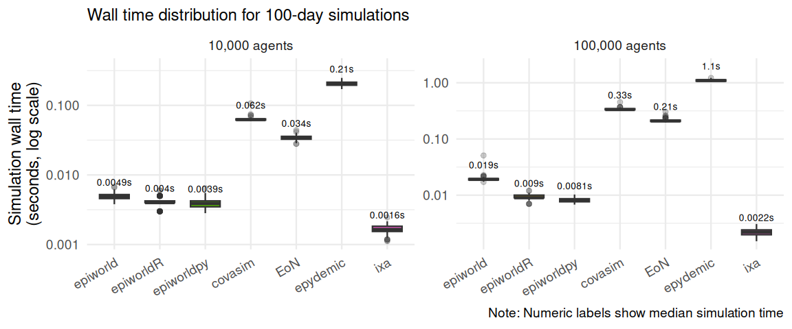
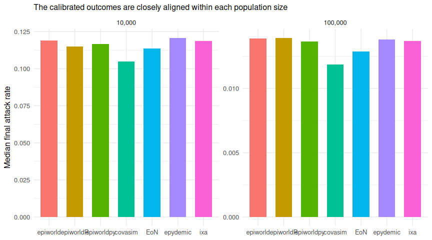

# Scenario 01: SEIRH + all-or-nothing vaccination

2026-09-26

- [Model](#model)
  - [Vaccine](#vaccine)
  - [Outputs](#outputs)
  - [Engine implementations](#engine-implementations)
- [Results](#results)
  - [Simulation time](#simulation-time)
  - [Speed relative to epiworldR](#speed-relative-to-epiworldr)
  - [The epiworld family](#the-epiworld-family)
  - [Epidemiological sanity checks](#epidemiological-sanity-checks)
- [Cost of the added complexity](#cost-of-the-added-complexity)
  - [Run time compared with scenario
    00](#run-time-compared-with-scenario-00)
  - [Code required to define the
    model](#code-required-to-define-the-model)
- [Interpretation](#interpretation)
  - [An implementation choice that mattered: epiworldR’s
    `distribute_tool_to_set()`](#an-implementation-choice-that-mattered-epiworldrs-distribute_tool_to_set)
  - [Calibration](#calibration)
- [Recorded versions](#recorded-versions)

[Back to the project overview](../README.md) · [Scenario 00
report](../scenario_00/README.md)

[Scenario 00](../scenario_00/README.md) plus a vaccine given before
transmission starts. The disease, network, seeds, run length, and
calibration are identical. So for any engine, size, and replicate, the
two scenarios differ only in the vaccine, and this report compares them
replicate by replicate.

## Model

### Vaccine

| Parameter (`scenario.toml`) | Value | Meaning |
|:---|---:|:---|
| `vaccine_coverage` | 0.30 | Share of all agents vaccinated |
| `vaccine_efficacy` | 0.80 | Probability that a vaccinated agent is protected |

- Before the first day, `round(vaccine_coverage * n)` agents are chosen
  uniformly at random and vaccinated.
- The vaccine is **all-or-nothing**. Each vaccinated agent is
  independently protected with probability `vaccine_efficacy`. A
  protected agent can never be infected. An unprotected one behaves
  exactly like an unvaccinated agent. A *leaky* vaccine would instead
  lower everyone’s per-contact risk by 80%.
- Vaccination is independent of the initial infections. A seed case that
  also gets vaccinated stays infected.

About 24% of agents end up protected, so the effective reproduction
number falls from about 2 to about 1.5. The disease parameters are those
of scenario 00.

### Outputs

Runners add two fields to each result record:

- `vaccinated`: the number of agents vaccinated.
- `vaccine_protected`: how many of them are protected, including any who
  were also seed cases.

Protected agents who are never infected are counted in
`final_susceptible`. So the five compartments still sum to `n`, and the
attack rate is still `1 - final_susceptible / n`.

### Engine implementations

Each engine uses its own way of expressing the vaccine, so the
model-lines comparison reflects what a user of that engine would write.

- **epiworldR**: a `tool()` with `susceptibility_reduction = 1`.
  Unprotected vaccinees need no tool, so the runner draws the number of
  protected agents from a binomial and lets epiworld place the tool on
  that many randomly chosen agents.
- **epiworld** (C++) and **epiworldpy**: the same tool, placed the same
  way. Each draws the number of protected agents with its own language’s
  random numbers, so unlike in scenario 00 the three runners’ epidemics
  differ replicate by replicate, though not in distribution. The C++
  library also has an all-or-nothing `ToolVaccine`, which neither
  wrapper exposes. It decides whether an agent is protected only when
  the agent is first exposed, so the number protected, which every
  runner reports, is not observable with it.
- **Covasim**: two day-0 `cv.simple_vaccine` interventions targeted with
  `subtarget`. One gives the protected agents `rel_sus = 0`, the other
  leaves the remaining vaccinees unchanged. A single `simple_vaccine`
  would be leaky. Covasim tracks `people.vaccinated` itself.
- **EoN**: protected agents start in a status `"V"` that has no
  transitions, so no induced transmission rate ever reaches them.
- **epydemic**: a `V` compartment with no events. It sits outside the
  S–I edge locus that drives infection. The vaccine is drawn in
  `initialCompartments`, which runs inside the timed simulation call;
  this adds well under a millisecond.
- **ixa**: a `VaccineStatus` property (`Unvaccinated`, `Protected`,
  `Unprotected`) on `Person`. The daily step skips protected neighbours
  when it looks for susceptible contacts.

## Results

> [!TIP]
>
> The complete 1,400-run design for this scenario is available.

| Field               | Value                                                 |
|:--------------------|:------------------------------------------------------|
| Platform            | Linux-6.12.13-200.fc41.aarch64-aarch64-with-glibc2.39 |
| Python              | 3.12.11                                               |
| Workers             | 1                                                     |
| Latest run failures | 0                                                     |

| Engine     | Agents | Runs | Median simulation (s) | Q1 (s) | Q3 (s) |
|:-----------|-------:|-----:|----------------------:|-------:|-------:|
| ixa        |  10000 |  100 |                 0.002 |  0.002 |  0.002 |
| epiworldpy |  10000 |  100 |                 0.004 |  0.003 |  0.004 |
| epiworldR  |  10000 |  100 |                 0.004 |  0.004 |  0.004 |
| epiworld   |  10000 |  100 |                 0.005 |  0.005 |  0.005 |
| EoN        |  10000 |  100 |                 0.034 |  0.033 |  0.036 |
| covasim    |  10000 |  100 |                 0.062 |  0.062 |  0.064 |
| epydemic   |  10000 |  100 |                 0.206 |  0.195 |  0.215 |
| ixa        | 100000 |  100 |                 0.002 |  0.002 |  0.002 |
| epiworldpy | 100000 |  100 |                 0.008 |  0.008 |  0.009 |
| epiworldR  | 100000 |  100 |                 0.009 |  0.009 |  0.010 |
| epiworld   | 100000 |  100 |                 0.019 |  0.019 |  0.020 |
| EoN        | 100000 |  100 |                 0.209 |  0.205 |  0.216 |
| covasim    | 100000 |  100 |                 0.334 |  0.332 |  0.345 |
| epydemic   | 100000 |  100 |                 1.097 |  1.069 |  1.128 |

### Simulation time

The primary measure is wall-clock time inside each engine’s simulation
call. The logarithmic scale keeps fast and slow engines legible in one
panel.

### Speed relative to epiworldR

Ratios are matched by population size and replicate seed. Values above
one mean that epiworldR completed the simulation call faster.

| Engine     | Agents | Median time / epiworldR |     Q1 |     Q3 |
|:-----------|-------:|------------------------:|-------:|-------:|
| epiworld   |  10000 |                    1.19 |   1.09 |   1.34 |
| epiworldpy |  10000 |                    0.96 |   0.84 |   1.07 |
| covasim    |  10000 |                   15.55 |  14.79 |  16.12 |
| EoN        |  10000 |                    8.51 |   7.49 |   9.07 |
| epydemic   |  10000 |                   50.39 |  45.28 |  54.88 |
| ixa        |  10000 |                    0.41 |   0.35 |   0.48 |
| epiworld   | 100000 |                    2.11 |   2.00 |   2.24 |
| epiworldpy | 100000 |                    0.89 |   0.83 |   0.96 |
| covasim    | 100000 |                   37.00 |  35.20 |  40.19 |
| EoN        | 100000 |                   23.33 |  22.21 |  25.17 |
| epydemic   | 100000 |                  120.62 | 115.84 | 129.83 |
| ixa        | 100000 |                    0.24 |   0.21 |   0.27 |

### The epiworld family

The wrappers compared with the C++ runner. Here the three draw the
number of protected agents with different random numbers, so they are
matched by seed but do not run identical epidemics. As in [scenario
00](../scenario_00/README.md#the-language-layer-costs-nothing-measurable-in-the-simulation),
the C++ runner’s slower simulation at 100,000 agents comes from where
its arrays land in memory, not from the language layer.

| Engine     | Agents | Median time / epiworld |   Q1 |   Q3 |
|:-----------|-------:|-----------------------:|-----:|-----:|
| epiworldR  |  10000 |                   0.84 | 0.75 | 0.92 |
| epiworldpy |  10000 |                   0.79 | 0.71 | 0.86 |
| epiworldR  | 100000 |                   0.47 | 0.45 | 0.50 |
| epiworldpy | 100000 |                   0.42 | 0.40 | 0.45 |

### Epidemiological sanity checks

Speed is interpretable only if the simulations produce plausible
epidemics. These checks show the final attack rate, peak hospitalization
load, and the share of agents the vaccine protected.

| Engine | Agents | Median final attack rate | Median peak hospitalized | Median share protected |
|:---|---:|---:|---:|---:|
| covasim | 10000 | 0.105 | 11 | 0.24 |
| EoN | 10000 | 0.113 | 10 | 0.24 |
| epiworld | 10000 | 0.119 | 8 | 0.24 |
| epiworldpy | 10000 | 0.117 | 8 | 0.24 |
| epiworldR | 10000 | 0.115 | 9 | 0.24 |
| epydemic | 10000 | 0.121 | 11 | 0.24 |
| ixa | 10000 | 0.119 | 8 | 0.24 |
| covasim | 100000 | 0.012 | 11 | 0.24 |
| EoN | 100000 | 0.013 | 10 | 0.24 |
| epiworld | 100000 | 0.014 | 9 | 0.24 |
| epiworldpy | 100000 | 0.014 | 9 | 0.24 |
| epiworldR | 100000 | 0.014 | 9 | 0.24 |
| epydemic | 100000 | 0.014 | 11 | 0.24 |
| ixa | 100000 | 0.014 | 9 | 0.24 |

## Cost of the added complexity

### Run time compared with scenario 00

Each replicate is paired with the scenario 00 replicate that has the
same engine, population size, and seed. Values above one mean that this
scenario took longer.

| Engine | Agents | Median scenario 00 (s) | Median scenario 01 (s) | Median time / scenario 00 | Q1 | Q3 |
|:---|---:|---:|---:|---:|---:|---:|
| ixa | 10000 | 0.004 | 0.002 | 0.40 | 0.35 | 0.43 |
| epydemic | 10000 | 0.489 | 0.206 | 0.41 | 0.39 | 0.44 |
| epiworldR | 10000 | 0.009 | 0.004 | 0.44 | 0.40 | 0.56 |
| EoN | 10000 | 0.077 | 0.034 | 0.45 | 0.41 | 0.48 |
| epiworldpy | 10000 | 0.008 | 0.004 | 0.46 | 0.40 | 0.52 |
| epiworld | 10000 | 0.009 | 0.005 | 0.52 | 0.47 | 0.57 |
| covasim | 10000 | 0.064 | 0.062 | 0.97 | 0.94 | 1.00 |
| ixa | 100000 | 0.008 | 0.002 | 0.27 | 0.24 | 0.30 |
| epiworldpy | 100000 | 0.015 | 0.008 | 0.55 | 0.50 | 0.61 |
| epiworldR | 100000 | 0.016 | 0.009 | 0.57 | 0.53 | 0.67 |
| epydemic | 100000 | 1.727 | 1.097 | 0.63 | 0.60 | 0.67 |
| EoN | 100000 | 0.293 | 0.209 | 0.72 | 0.68 | 0.76 |
| epiworld | 100000 | 0.026 | 0.019 | 0.74 | 0.69 | 0.79 |
| covasim | 100000 | 0.326 | 0.334 | 1.03 | 1.02 | 1.06 |

Run time does not isolate the cost of the vaccine machinery. The vaccine
cuts the median attack rate from about 0.39 to 0.12 at 10,000 agents and
from 0.061 to 0.013 at 100,000. Engines whose work tracks the number of
active infections (EoN, epydemic, the epiworld family, and ixa) get
faster for that reason alone. Covasim’s vectorized daily update touches
every agent regardless of the outbreak’s size, so its time barely moves.
A ratio below one therefore does not mean the vaccine is free. It means
that the engine’s handling of the vaccine costs less than the smaller
outbreak saves. A ratio above one would mean the feature itself is
expensive, as epiworldR’s `distribute_tool_to_set()` was before version
0.16.1 (see below).

### Code required to define the model

A rough measure of effort: how much code each engine needs to express
this scenario, and how much it added to scenario 00. The counting rules
are described in the [project
overview](../README.md#measuring-implementation-effort), and the counted
regions are listed in [`code_regions.yml`](code_regions.yml).

| Engine | Language | Files | Lines, scenario 00 | Lines, scenario 01 | Added since scenario 00 |
|:---|:---|---:|---:|---:|---:|
| epiworld | C++ | 1 | 26 | 34 | 8 |
| epiworldpy | Python | 1 | 34 | 38 | 4 |
| EoN | Python | 1 | 37 | 44 | 7 |
| epiworldR | R | 1 | 47 | 62 | 15 |
| covasim | Python | 1 | 64 | 75 | 11 |
| epydemic | Python | 1 | 70 | 88 | 18 |
| ixa | Rust | 3 | 133 | 164 | 31 |

EoN and epydemic only need a compartment with no transitions. Covasim
has a vaccine intervention, but it is leaky, so an all-or-nothing
vaccine takes two targeted doses. epiworldR has a tool that removes
susceptibility. ixa adds an agent property that its hand-written
transmission step has to consult.

## Interpretation

### An implementation choice that mattered: epiworldR’s `distribute_tool_to_set()`

The most direct epiworldR implementation draws the protected agents in R
and hands them to the tool with `distribute_tool_to_set()`. In epiworldR
0.15.1.0 that function was quadratic in the number of agents. Every
per-agent `add_tool()` cloned the tool, and the clone carried a copy of
the whole list of target IDs. Placing the tool on about 24,000 named
agents took roughly 4.6 seconds per run at 100,000 agents, against 0.03
seconds with the approach the runner uses: draw the number of protected
agents, and let epiworld place the tool at random. Both give the same
vaccine statistically. epiworldR 0.16.1 fixed the quadratic cost, so
either approach is now fast; the runner keeps the second.

### Calibration

The transmission multipliers are copied from scenario 00. They correct
each engine’s transmission semantics rather than anything specific to
this scenario, so they were not recalibrated. The table above shows that
the engines’ attack rates stay aligned with the vaccine in place.

## Recorded versions

| Engine     | Recorded version  |
|:-----------|:------------------|
| covasim    | 3.1.8             |
| EoN        | 1.92              |
| epiworld   | 0.17.0            |
| epiworldpy | 0.17.0-0+g583c55e |
| epiworldR  | 0.17.0.0          |
| epydemic   | 1.14.1            |
| ixa        | 3.1.0             |
