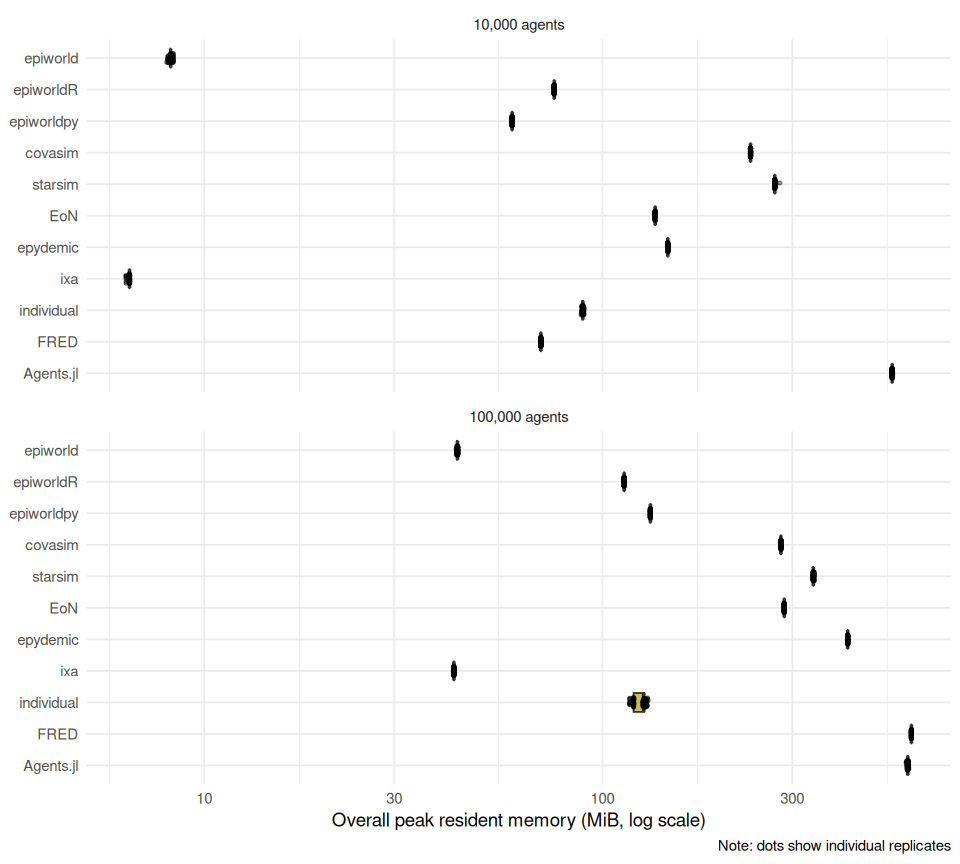

# Scenario 01: SEIRH + all-or-nothing vaccination

2026-09-30

- [Model](#model)
  - [Vaccine](#vaccine)
  - [Outputs](#outputs)
  - [Engine implementations](#engine-implementations)
- [Results](#results)
  - [Simulation time](#simulation-time)
  - [Speed relative to epiworldR](#speed-relative-to-epiworldr)
  - [Time to a first result](#time-to-a-first-result)
  - [The epiworld family](#the-epiworld-family)
  - [Memory](#memory)
  - [Epidemiological sanity checks](#epidemiological-sanity-checks)
- [Cost of the added complexity](#cost-of-the-added-complexity)
  - [Run time compared with scenario
    00](#run-time-compared-with-scenario-00)
  - [Code required to define the
    model](#code-required-to-define-the-model)
- [Interpretation](#interpretation)
  - [An implementation choice that mattered: epiworldR’s
    `distribute_tool_to_set()`](#an-implementation-choice-that-mattered-epiworldrs-distribute_tool_to_set)
  - [An implementation choice that mattered: Agents.jl’s vaccine
    loop](#an-implementation-choice-that-mattered-agentsjls-vaccine-loop)
  - [What the vaccine costs epiworld and
    ixa](#what-the-vaccine-costs-epiworld-and-ixa)
  - [Calibration](#calibration)
- [Recorded versions](#recorded-versions)

[Back to the project overview](../README.md) · [Scenario 00
report](../scenario_00/README.md)

[Scenario 00](../scenario_00/README.md) plus a vaccine given before
transmission starts. The disease, network, seeds, run length, and
calibration are identical. So for any engine, size, and replicate, the
two scenarios differ only in the vaccine, and this report compares them
replicate by replicate.

## Model

### Vaccine

| Parameter (`scenario.toml`) | Value | Meaning |
|:---|---:|:---|
| `vaccine_coverage` | 0.30 | Share of all agents vaccinated |
| `vaccine_efficacy` | 0.80 | Probability that a vaccinated agent is protected |

- Before the first day, `round(vaccine_coverage * n)` agents are chosen
  uniformly at random and vaccinated.
- The vaccine is **all-or-nothing**. Each vaccinated agent is
  independently protected with probability `vaccine_efficacy`. A
  protected agent can never be infected. An unprotected one behaves
  exactly like an unvaccinated agent. A *leaky* vaccine would instead
  lower everyone’s per-contact risk by 80%.
- Vaccination is independent of the initial infections. A seed case that
  also gets vaccinated stays infected.
- Distributing the vaccine is timed as part of the simulation in every
  runner, as seeding is (see [scenario 00](../scenario_00/README.md)).
  The draw differs in every run, and epiworld places its tools inside
  `run()`, so the other runners time their draw too. EoN’s timer covers
  building its initial status dictionary. Covasim’s covers the draw, and
  Covasim gives the doses on day 0 inside `sim.run()`. Starsim draws the
  vaccinees when its day-0 campaign runs, inside `sim.run()`. epydemic
  draws inside its simulation call, and ixa in a plan at time 0, inside
  `execute()`. individual’s and Agents.jl’s timers cover their draws,
  and FRED draws its vaccinees with an import on day 0, inside its run.
  The epiworld runners draw only the number of protected agents (one
  binomial draw) before `run()`.

About 24% of agents end up protected, so the effective reproduction
number falls from about 2 to about 1.5. The disease parameters are those
of scenario 00.

### Outputs

Runners add two fields to each result record:

- `vaccinated`: the number of agents vaccinated.
- `vaccine_protected`: how many of them are protected, including any who
  were also seed cases.

Protected agents who are never infected are counted in
`final_susceptible`. So the five compartments still sum to `n`, and the
attack rate is still `1 - final_susceptible / n`.

### Engine implementations

Each engine uses its own way of expressing the vaccine, so the
model-lines comparison reflects what a user of that engine would write.

- **epiworldR**: a `tool()` with `susceptibility_reduction = 1`.
  Unprotected vaccinees need no tool, so the runner draws the number of
  protected agents from a binomial and lets epiworld place the tool on
  that many randomly chosen agents.
- **epiworld** (C++) and **epiworldpy**: the same tool, placed the same
  way. Each draws the number of protected agents with its own language’s
  random numbers, so unlike in scenario 00 the three runners’ epidemics
  differ replicate by replicate, though not in distribution. The C++
  library also has an all-or-nothing `ToolVaccine`, which neither
  wrapper exposes. It decides whether an agent is protected only when
  the agent is first exposed, so the number protected, which every
  runner reports, is not observable with it.
- **Covasim**: two day-0 `cv.simple_vaccine` interventions targeted with
  `subtarget`. One gives the protected agents `rel_sus = 0`, the other
  leaves the remaining vaccinees unchanged. A single `simple_vaccine`
  would be leaky. Covasim tracks `people.vaccinated` itself.
- **Starsim**: its own all-or-nothing vaccine,
  `ss.simple_vx(leaky=False)`, delivered by a day-0 `ss.campaign_vx` to
  the drawn agents (the campaign’s eligibility function returns them).
  The vaccine sets `rel_sus = 0` for the protected vaccinees; Starsim
  applies interventions before transmission within a step. `simple_vx`
  draws who is protected from NumPy’s global generator, so the runner
  seeds it.
- **EoN**: protected agents start in a status `"V"` that has no
  transitions, so no induced transmission rate ever reaches them.
- **epydemic**: a `V` compartment with no events. It sits outside the
  S–I edge locus that drives infection. The vaccine is drawn in
  `initialCompartments`, which runs inside the timed simulation call.
- **ixa**: a `VaccineStatus` property (`Unvaccinated`, `Protected`,
  `Unprotected`) on `Person`, set by a plan at time 0. The daily step
  skips protected neighbours when it looks for susceptible contacts.
- **individual**: no intervention objects, so the protected agents are a
  `Bitset`, and the infection process intersects the susceptible agents
  with its complement.
- **FRED**: a second condition, `VAX`, written the way FRED’s own
  `models/vaccine` example writes a vaccine. On day 0, `import_count()`
  moves exactly `round(vaccine_coverage * n)` agents, drawn uniformly,
  into its vaccinated state, which moves each to `Protected` with
  probability `vaccine_efficacy`; `Protected` sets the agent’s
  susceptibility to the disease to 0 with `set_sus()`. The disease
  condition is declared first, so its seed cases are imported before the
  vaccinees are drawn, and a protected seed case stays infected. The
  counts come from FRED’s daily report for `VAX`.
- **Agents.jl**: a `protected` field on the agent type, set before the
  seed cases are drawn. The daily step skips protected neighbours when
  it looks for susceptible contacts.

## Results

> [!TIP]
>
> The complete 2,200-run design for this scenario is available.

| Field | Value |
|:---|:---|
| CPU | Apple M3 Pro (container sees: Apple (model not reported)) |
| Cores | 10 logical, 10 physical |
| Memory | 12.7 GiB |
| OS | Linux-6.12.13-200.fc41.aarch64-aarch64-with-glibc2.39 |
| Kernel | 6.12.13-200.fc41.aarch64 |
| Container image | 6ab6f982c445 |
| Python | 3.12.11 |
| R | R version 4.5.1 (2025-06-13) – “Great Square Root” |
| Julia | julia version 1.13.1 |
| Rust | rustc 1.98.0 (88d9e12ae 2026-08-18) |
| C++ compiler | c++ (Ubuntu 13.3.0-6ubuntu2~24.04) 13.3.0 |
| Quarto | 1.10.18 |
| Repository commit | 467d650 |
| Workers | 1 |
| Run dates | 2026-09-30 to 2026-09-30 |
| Latest run | 2200 executed, 0 cached, 0 failed |

| Engine     | Agents | Runs | Median simulation (s) | Q1 (s) | Q3 (s) |
|:-----------|-------:|-----:|----------------------:|-------:|-------:|
| epiworldR  |  10000 |  100 |                 0.002 |  0.002 |  0.002 |
| epiworldpy |  10000 |  100 |                 0.002 |  0.002 |  0.002 |
| epiworld   |  10000 |  100 |                 0.002 |  0.002 |  0.002 |
| ixa        |  10000 |  100 |                 0.004 |  0.004 |  0.004 |
| Agents.jl  |  10000 |  100 |                 0.020 |  0.020 |  0.020 |
| individual |  10000 |  100 |                 0.021 |  0.021 |  0.022 |
| EoN        |  10000 |  100 |                 0.034 |  0.033 |  0.036 |
| FRED       |  10000 |  100 |                 0.054 |  0.053 |  0.056 |
| covasim    |  10000 |  100 |                 0.062 |  0.061 |  0.064 |
| starsim    |  10000 |  100 |                 0.169 |  0.167 |  0.178 |
| epydemic   |  10000 |  100 |                 0.203 |  0.195 |  0.215 |
| epiworldpy | 100000 |  100 |                 0.006 |  0.006 |  0.006 |
| epiworldR  | 100000 |  100 |                 0.007 |  0.006 |  0.007 |
| epiworld   | 100000 |  100 |                 0.007 |  0.007 |  0.007 |
| ixa        | 100000 |  100 |                 0.029 |  0.028 |  0.031 |
| Agents.jl  | 100000 |  100 |                 0.037 |  0.036 |  0.038 |
| individual | 100000 |  100 |                 0.049 |  0.048 |  0.050 |
| EoN        | 100000 |  100 |                 0.211 |  0.208 |  0.219 |
| covasim    | 100000 |  100 |                 0.334 |  0.333 |  0.336 |
| FRED       | 100000 |  100 |                 0.587 |  0.580 |  0.595 |
| starsim    | 100000 |  100 |                 0.908 |  0.831 |  0.931 |
| epydemic   | 100000 |  100 |                 1.075 |  1.060 |  1.087 |

### Simulation time

The primary measure is wall-clock time inside each engine’s simulation
call. The logarithmic scale keeps fast and slow engines legible in one
panel.

### Speed relative to epiworldR

Ratios are matched by population size and replicate seed. Values above
one mean that epiworldR completed the simulation call faster.

| Engine     | Agents | Median time / epiworldR |     Q1 |     Q3 |
|:-----------|-------:|------------------------:|-------:|-------:|
| epiworld   |  10000 |                    1.06 |   0.91 |   1.12 |
| epiworldpy |  10000 |                    0.97 |   0.82 |   1.10 |
| covasim    |  10000 |                   30.72 |  30.04 |  32.23 |
| starsim    |  10000 |                   83.86 |  82.95 |  88.40 |
| EoN        |  10000 |                   17.00 |  15.29 |  18.01 |
| epydemic   |  10000 |                  100.92 |  89.17 | 107.36 |
| ixa        |  10000 |                    2.12 |   1.94 |   2.21 |
| individual |  10000 |                   10.50 |  10.00 |  11.00 |
| FRED       |  10000 |                   26.90 |  25.98 |  27.88 |
| Agents.jl  |  10000 |                    9.84 |   9.74 |   9.98 |
| epiworld   | 100000 |                    1.04 |   0.98 |   1.12 |
| epiworldpy | 100000 |                    0.87 |   0.81 |   0.96 |
| covasim    | 100000 |                   47.79 |  47.51 |  55.39 |
| starsim    | 100000 |                  129.73 | 116.46 | 139.36 |
| EoN        | 100000 |                   30.33 |  29.54 |  34.50 |
| epydemic   | 100000 |                  154.54 | 151.14 | 175.77 |
| ixa        | 100000 |                    4.21 |   4.04 |   4.74 |
| individual | 100000 |                    7.14 |   6.86 |   8.00 |
| FRED       | 100000 |                   84.57 |  82.93 |  96.26 |
| Agents.jl  | 100000 |                    5.41 |   5.16 |   6.20 |

### Time to a first result

The simulation time above covers what an engine has to redo for every
replicate on the same network (see [what is
measured](../README.md#run-time)). *Build* is the rest of the setup:
turning the edge list into the engine’s population and network, which a
user does once per network. *Build + simulate* is the time to a first
result once the edge list is in memory. Reading the edge file is shown
but left out of it, because its cost depends on each language’s file
parsing rather than on the engine.

| Engine     | Agents | Read edges (s) | Build (s) | Simulate (s) | Build + simulate (s) |
|:-----------|-------:|---------------:|----------:|-------------:|---------------------:|
| epiworld   |  10000 |          0.005 |     0.001 |        0.002 |                0.003 |
| ixa        |  10000 |          0.003 |     0.000 |        0.004 |                0.004 |
| epiworldpy |  10000 |          0.016 |     0.007 |        0.002 |                0.009 |
| epiworldR  |  10000 |          0.007 |     0.016 |        0.002 |                0.018 |
| individual |  10000 |          0.007 |     0.018 |        0.021 |                0.039 |
| Agents.jl  |  10000 |          0.175 |     0.020 |        0.020 |                0.040 |
| EoN        |  10000 |          0.016 |     0.028 |        0.034 |                0.063 |
| covasim    |  10000 |          0.016 |     0.038 |        0.062 |                0.100 |
| starsim    |  10000 |          0.016 |     0.000 |        0.169 |                0.170 |
| FRED       |  10000 |          0.241 |     0.129 |        0.054 |                0.184 |
| epydemic   |  10000 |          0.015 |     0.017 |        0.203 |                0.221 |
| epiworld   | 100000 |          0.048 |     0.011 |        0.007 |                0.018 |
| ixa        | 100000 |          0.028 |     0.000 |        0.029 |                0.029 |
| epiworldR  | 100000 |          0.071 |     0.031 |        0.007 |                0.038 |
| epiworldpy | 100000 |          0.151 |     0.040 |        0.006 |                0.046 |
| Agents.jl  | 100000 |          0.276 |     0.037 |        0.037 |                0.075 |
| individual | 100000 |          0.068 |     0.030 |        0.049 |                0.079 |
| covasim    | 100000 |          0.154 |     0.039 |        0.334 |                0.373 |
| EoN        | 100000 |          0.157 |     0.243 |        0.211 |                0.457 |
| starsim    | 100000 |          0.151 |     0.000 |        0.908 |                0.908 |
| epydemic   | 100000 |          0.146 |     0.278 |        1.075 |                1.354 |
| FRED       | 100000 |          2.415 |     0.821 |        0.587 |                1.410 |

### The epiworld family

The wrappers compared with the C++ runner. Here the three draw the
number of protected agents with different random numbers, so they are
matched by seed but do not run identical epidemics. Here the C++ runner
is slower than the wrappers at 100,000 agents, although it runs the same
library. This comes from memory allocation, not from the language layer.
Placing the vaccine allocates about 24,000 tool objects inside `run()`.
The C++ runner starts with a small heap, which grows during those
allocations; R and Python have already grown a large heap while starting
up. Run alone, the C++ runner takes a median 10.9 ms here, and about 9
ms when glibc is told to keep a large heap in reserve
(`MALLOC_TOP_PAD_`) or to serve large blocks from the heap rather than
with `mmap` (`MALLOC_MMAP_THRESHOLD_`). The runner is timed as a C++
user would write it, so the published numbers keep this effect.

| Engine     | Agents | Median time / epiworld |   Q1 |   Q3 |
|:-----------|-------:|-----------------------:|-----:|-----:|
| epiworldR  |  10000 |                   0.95 | 0.89 | 1.10 |
| epiworldpy |  10000 |                   0.94 | 0.83 | 1.04 |
| epiworldR  | 100000 |                   0.96 | 0.89 | 1.02 |
| epiworldpy | 100000 |                   0.83 | 0.79 | 0.87 |

### Memory

Resident memory (RSS) of each run, in MiB, as median \[Q1, Q3\] across
replicates. *Simulation memory* is the peak during the simulate timer
less the memory held when it started: the extra memory one replicate
needs. *Model footprint* is what building the reusable model adds after
the edge list is read, and *baseline* is the runtime after its imports.
FRED runs as a child process, so only its overall peak is known. See
“Memory” under “What is measured” in the
[overview](../README.md#memory).

| Engine | Agents | Baseline (MiB) | Model footprint (MiB) | Simulation memory (MiB) | Overall peak (MiB) |
|:---|:---|---:|---:|---:|---:|
| ixa | 10000 | 2.2 \[2.2, 2.2\] | 0.0 \[0.0, 0.0\] | 3.1 \[3.1, 3.1\] | 6.5 \[6.5, 6.5\] |
| epiworld | 10000 | 2.9 \[2.9, 2.9\] | 2.5 \[2.5, 2.5\] | 1.8 \[1.8, 1.8\] | 8.2 \[8.2, 8.2\] |
| epiworldpy | 10000 | 46.7 \[46.7, 46.7\] | 7.0 \[7.0, 7.0\] | 0.5 \[0.5, 0.6\] | 59.3 \[59.3, 59.3\] |
| FRED | 10000 |  |  |  | 70.1 \[70.0, 70.1\] |
| epiworldR | 10000 | 72.1 \[72.1, 72.1\] | 2.8 \[2.8, 2.8\] | 0.0 \[0.0, 0.0\] | 75.7 \[75.6, 75.7\] |
| individual | 10000 | 74.8 \[74.8, 74.8\] | 1.5 \[1.5, 1.5\] | 9.6 \[9.4, 9.9\] | 89.3 \[89.0, 89.4\] |
| EoN | 10000 | 120.3 \[120.3, 120.4\] | 10.3 \[10.1, 10.3\] | 2.2 \[2.1, 2.2\] | 135.7 \[135.6, 135.8\] |
| epydemic | 10000 | 117.2 \[117.2, 117.2\] | 9.9 \[9.9, 10.1\] | 15.6 \[15.6, 15.6\] | 146.0 \[146.0, 146.0\] |
| covasim | 10000 | 225.2 \[225.1, 225.2\] | 1.8 \[1.8, 1.8\] | 5.4 \[5.2, 5.5\] | 235.6 \[235.5, 235.6\] |
| starsim | 10000 | 260.9 \[260.9, 260.9\] | 0.0 \[0.0, 0.0\] | 7.1 \[6.8, 7.1\] | 271.0 \[271.0, 271.0\] |
| Agents.jl | 10000 | 483.9 \[483.8, 484.2\] | 0.5 \[0.5, 0.5\] | 0.4 \[0.4, 0.4\] | 534.5 \[533.9, 535.1\] |
| ixa | 100000 | 2.2 \[2.2, 2.2\] | 0.0 \[0.0, 0.0\] | 32.1 \[32.1, 32.1\] | 42.4 \[42.4, 42.4\] |
| epiworld | 100000 | 2.9 \[2.9, 2.9\] | 23.5 \[23.5, 23.5\] | 12.2 \[12.1, 12.2\] | 43.2 \[43.1, 43.2\] |
| epiworldR | 100000 | 72.1 \[72.1, 72.1\] | 23.6 \[23.6, 23.6\] | 0.0 \[0.0, 0.0\] | 113.4 \[113.4, 113.4\] |
| individual | 100000 | 74.8 \[74.8, 74.8\] | 6.2 \[6.2, 6.2\] | 34.6 \[27.4, 34.9\] | 127.0 \[119.8, 127.3\] |
| epiworldpy | 100000 | 46.7 \[46.7, 46.7\] | 38.7 \[38.7, 39.6\] | 0.9 \[0.9, 1.0\] | 132.0 \[132.0, 132.0\] |
| covasim | 100000 | 225.2 \[225.1, 225.2\] | 3.2 \[3.2, 3.5\] | 41.9 \[41.9, 42.2\] | 280.8 \[280.7, 281.1\] |
| EoN | 100000 | 120.3 \[120.3, 120.4\] | 125.9 \[125.9, 125.9\] | 30.4 \[30.4, 30.4\] | 286.3 \[286.3, 286.3\] |
| starsim | 100000 | 260.9 \[260.9, 260.9\] | 0.0 \[0.0, 0.0\] | 67.6 \[67.2, 67.7\] | 338.7 \[338.7, 338.7\] |
| epydemic | 100000 | 117.2 \[117.2, 117.2\] | 126.2 \[126.2, 126.4\] | 160.5 \[160.5, 160.5\] | 413.3 \[413.2, 413.3\] |
| Agents.jl | 100000 | 484.1 \[484.0, 484.4\] | 6.9 \[5.7, 8.5\] | 2.0 \[1.9, 2.1\] | 584.8 \[583.5, 586.1\] |
| FRED | 100000 |  |  |  | 597.4 \[597.4, 597.4\] |

### Epidemiological sanity checks

Speed is interpretable only if the simulations produce plausible
epidemics. These checks show the final attack rate, peak hospitalization
load, and the share of agents the vaccine protected.

| Engine | Agents | Median final attack rate | Median peak hospitalized | Median share protected |
|:---|---:|---:|---:|---:|
| Agents.jl | 10000 | 0.118 | 8 | 0.24 |
| covasim | 10000 | 0.105 | 11 | 0.24 |
| EoN | 10000 | 0.113 | 10 | 0.24 |
| epiworld | 10000 | 0.119 | 8 | 0.24 |
| epiworldpy | 10000 | 0.117 | 8 | 0.24 |
| epiworldR | 10000 | 0.115 | 9 | 0.24 |
| epydemic | 10000 | 0.121 | 11 | 0.24 |
| FRED | 10000 | 0.115 | 10 | 0.24 |
| individual | 10000 | 0.117 | 9 | 0.24 |
| ixa | 10000 | 0.119 | 8 | 0.24 |
| starsim | 10000 | 0.119 | 9 | 0.24 |
| Agents.jl | 100000 | 0.014 | 9 | 0.24 |
| covasim | 100000 | 0.012 | 11 | 0.24 |
| EoN | 100000 | 0.013 | 10 | 0.24 |
| epiworld | 100000 | 0.014 | 9 | 0.24 |
| epiworldpy | 100000 | 0.014 | 9 | 0.24 |
| epiworldR | 100000 | 0.014 | 9 | 0.24 |
| epydemic | 100000 | 0.014 | 11 | 0.24 |
| FRED | 100000 | 0.012 | 10 | 0.24 |
| individual | 100000 | 0.013 | 10 | 0.24 |
| ixa | 100000 | 0.014 | 9 | 0.24 |
| starsim | 100000 | 0.014 | 10 | 0.24 |

## Cost of the added complexity

### Run time compared with scenario 00

Each replicate is paired with the scenario 00 replicate that has the
same engine, population size, and seed. Values above one mean that this
scenario took longer.

| Engine | Agents | Median scenario 00 (s) | Median scenario 01 (s) | Median time / scenario 00 | Q1 | Q3 |
|:---|---:|---:|---:|---:|---:|---:|
| epydemic | 10000 | 0.489 | 0.203 | 0.42 | 0.39 | 0.45 |
| EoN | 10000 | 0.076 | 0.034 | 0.45 | 0.42 | 0.49 |
| epiworldpy | 10000 | 0.004 | 0.002 | 0.50 | 0.45 | 0.55 |
| epiworldR | 10000 | 0.004 | 0.002 | 0.50 | 0.40 | 0.50 |
| epiworld | 10000 | 0.004 | 0.002 | 0.50 | 0.46 | 0.56 |
| ixa | 10000 | 0.007 | 0.004 | 0.63 | 0.61 | 0.67 |
| FRED | 10000 | 0.066 | 0.054 | 0.81 | 0.77 | 0.88 |
| individual | 10000 | 0.024 | 0.021 | 0.88 | 0.84 | 0.92 |
| covasim | 10000 | 0.062 | 0.062 | 0.99 | 0.98 | 1.03 |
| Agents.jl | 10000 | 0.020 | 0.020 | 1.01 | 0.96 | 1.03 |
| starsim | 10000 | 0.165 | 0.169 | 1.04 | 1.02 | 1.08 |
| epydemic | 100000 | 1.706 | 1.075 | 0.63 | 0.60 | 0.66 |
| EoN | 100000 | 0.285 | 0.211 | 0.75 | 0.72 | 0.78 |
| epiworldpy | 100000 | 0.007 | 0.006 | 0.81 | 0.75 | 0.89 |
| epiworldR | 100000 | 0.008 | 0.007 | 0.87 | 0.75 | 0.88 |
| ixa | 100000 | 0.033 | 0.029 | 0.88 | 0.85 | 0.92 |
| individual | 100000 | 0.053 | 0.049 | 0.92 | 0.89 | 0.95 |
| epiworld | 100000 | 0.008 | 0.007 | 0.94 | 0.85 | 1.01 |
| starsim | 100000 | 0.905 | 0.908 | 1.00 | 0.92 | 1.03 |
| Agents.jl | 100000 | 0.037 | 0.037 | 1.02 | 0.99 | 1.04 |
| covasim | 100000 | 0.324 | 0.334 | 1.03 | 1.00 | 1.04 |
| FRED | 100000 | 0.485 | 0.587 | 1.21 | 1.17 | 1.24 |

Run time does not isolate the cost of the vaccine machinery. The vaccine
cuts the median attack rate from about 0.39 to 0.12 at 10,000 agents and
from 0.061 to 0.013 at 100,000. Engines whose work tracks the number of
active infections (EoN, epydemic, the epiworld family, and ixa) get
faster for that reason alone. Covasim’s vectorized daily update touches
every agent regardless of the outbreak’s size, and Starsim’s draws
transmission on every edge every day, so their times barely move.
individual’s infection process scans the infectious agents’ neighbours
but also works on full-population bitsets every day, so it sits in
between. A ratio below one therefore does not mean the vaccine is free.
It means that the engine’s handling of the vaccine costs less than the
smaller outbreak saves. A ratio above one would mean the feature itself
is expensive, as epiworldR’s `distribute_tool_to_set()` was before
version 0.16.1 (see below).

### Code required to define the model

A rough measure of effort: how much code each engine needs to express
this scenario, and how much it added to scenario 00. The counting rules
are described in the [project
overview](../README.md#measuring-implementation-effort), and the counted
regions are listed in [`code_regions.yml`](code_regions.yml).

| Engine | Language | Files | Lines, scenario 00 | Lines, scenario 01 | Added since scenario 00 |
|:---|:---|---:|---:|---:|---:|
| epiworld | C++ | 1 | 26 | 34 | 8 |
| individual | R | 1 | 32 | 37 | 5 |
| epiworldpy | Python | 1 | 35 | 39 | 4 |
| EoN | Python | 1 | 38 | 45 | 7 |
| epiworldR | R | 1 | 47 | 62 | 15 |
| covasim | Python | 1 | 65 | 76 | 11 |
| Agents.jl | Julia | 1 | 68 | 83 | 15 |
| epydemic | Python | 1 | 71 | 89 | 18 |
| starsim | Python | 1 | 84 | 95 | 11 |
| FRED | Python | 1 | 92 | 123 | 31 |
| ixa | Rust | 3 | 138 | 168 | 30 |

EoN and epydemic only need a compartment with no transitions. Covasim
has a vaccine intervention, but it is leaky, so an all-or-nothing
vaccine takes two targeted doses. Starsim’s own vaccine product supports
all-or-nothing protection directly, and needs only a campaign to deliver
it. epiworldR has a tool that removes susceptibility. ixa adds an agent
property that its hand-written transmission step has to consult, and
individual a set that its infection process leaves out.

## Interpretation

### An implementation choice that mattered: epiworldR’s `distribute_tool_to_set()`

The most direct epiworldR implementation draws the protected agents in R
and hands them to the tool with `distribute_tool_to_set()`. In epiworldR
0.15.1.0 that function was quadratic in the number of agents. Every
per-agent `add_tool()` cloned the tool, and the clone carried a copy of
the whole list of target IDs. Placing the tool on about 24,000 named
agents took roughly 4.6 seconds per run at 100,000 agents, against 0.03
seconds with the approach the runner uses: draw the number of protected
agents, and let epiworld place the tool at random. Both give the same
vaccine statistically. epiworldR 0.16.1 fixed the quadratic cost, so
either approach is now fast; the runner keeps the second.

### An implementation choice that mattered: Agents.jl’s vaccine loop

The first Agents.jl runner drew the vaccine in a loop at the script’s
top level, over Julia’s untyped global variables. That doubled its
simulation time at 10,000 agents, from about 0.02 to 0.05 seconds.
Moving the loop into a function, which Julia compiles for concrete types
(and which the warm-up model compiles before any timer starts), removed
the cost; the published runner does that, as a Julia user would.

### What the vaccine costs epiworld and ixa

Both place the vaccine inside the timed call, before the first day.
epiworld clones the tool onto the heap for each of the roughly 24,000
protected agents at 100,000 agents, which takes about 3.2 ms per run;
ixa sets a property on each of the 30,000 vaccinees in a plan at time 0,
about 1.7 ms. Because the vaccine also shrinks the outbreak, this fixed
cost is a larger share of epiworld’s time here than in scenario 00.
ixa’s time per replicate is still mostly rebuilding its context.
[analysis.md](../analysis.md) has the measurements, and explains the
rest of the difference between the two engines.

### Calibration

The transmission multipliers are copied from scenario 00. They correct
each engine’s transmission semantics rather than anything specific to
this scenario, so they were not recalibrated. The table above shows that
the engines’ attack rates stay aligned with the vaccine in place. FRED’s
sits a little below the others at 100,000 agents, where the outbreak is
smallest.

## Recorded versions

| Engine     | Recorded version   |
|:-----------|:-------------------|
| Agents.jl  | 7.0.4              |
| covasim    | 3.1.8              |
| EoN        | 1.92               |
| epiworld   | 0.17.1+g04c4ad8    |
| epiworldpy | 0.17.1-0+gc24b4f9  |
| epiworldR  | 0.17.1.0+gfca60f3  |
| epydemic   | 1.14.1             |
| FRED       | PUB.5.7.0+gbd25f04 |
| individual | 0.1.19             |
| ixa        | 3.1.0              |
| starsim    | 3.6.1              |
