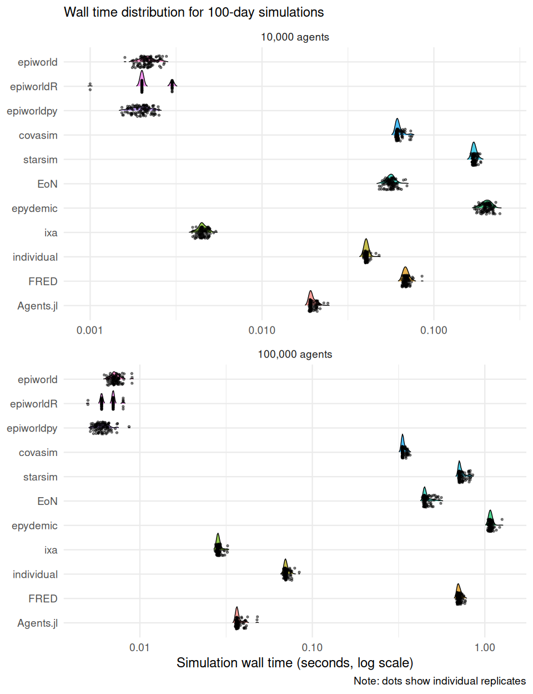
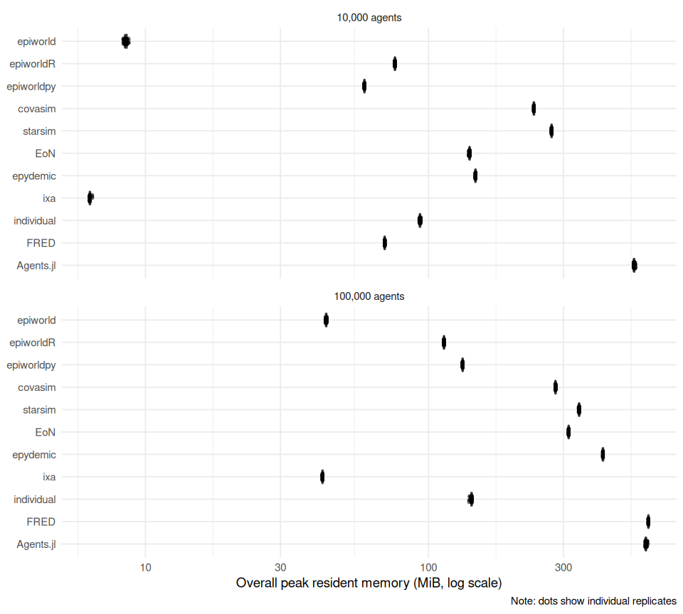
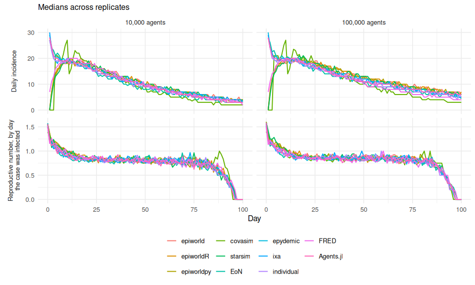

# Scenario 02: SEIRH + vaccination + epidemiological outputs

2026-10-01

- [Model](#model)
  - [Outputs](#outputs)
  - [Timing](#timing)
  - [Result fields](#result-fields)
  - [Engine implementations](#engine-implementations)
- [Results](#results)
  - [Simulation time](#simulation-time)
  - [Speed relative to epiworldR](#speed-relative-to-epiworldr)
  - [Time to a first result](#time-to-a-first-result)
  - [Extracting the outputs](#extracting-the-outputs)
  - [Memory](#memory)
  - [Epidemiological sanity checks](#epidemiological-sanity-checks)
- [Cost of the outputs](#cost-of-the-outputs)
  - [Run time compared with scenario
    01](#run-time-compared-with-scenario-01)
  - [Code required to define the
    model](#code-required-to-define-the-model)
- [Interpretation](#interpretation)
  - [What recording the outputs
    costs](#what-recording-the-outputs-costs)
  - [Is bookkeeping what separates epiworld and
    ixa?](#is-bookkeeping-what-separates-epiworld-and-ixa)
  - [An implementation choice that mattered: epiworldR’s
    reproductive-number
    summary](#an-implementation-choice-that-mattered-epiworldrs-reproductive-number-summary)
- [Recorded versions](#recorded-versions)

[Back to the project overview](../README.md) · [Scenario 01
report](../scenario_01/README.md)

[Scenario 01](../scenario_01/README.md), unchanged, plus four outputs
that every engine has to produce from each run: the transmission tree,
daily incidence, the reproductive number, and the daily transition
matrix.

epiworld records all four during every run, in every scenario, whether
or not anyone reads them. The other engines record less by default, so
in scenarios 00 and 01 the epiworld family does bookkeeping that the
others skip. Here every engine has to deliver the same information, so
the comparison includes that bookkeeping for all of them.

The model, network, seeds, run length, and calibration are those of
scenario 01. For every engine but individual, the two scenarios run the
same epidemic for a given size and replicate, and this report compares
them replicate by replicate. individual’s runner picks each new case’s
source with R’s global random numbers, which its disease processes also
use, so from the first such draw its epidemic differs from scenario 01’s
for the same seed. The two are still the same model, with the same
distribution of outcomes; only the pairing by seed is lost.

## Model

### Outputs

Each runner produces the following from each run and holds them in
memory in the engine’s own data structures. Nothing is written to disk.

| Output | Definition |
|:---|:---|
| Transmission tree | The day, source, and target of every infection. Seed cases have no source. |
| Daily incidence | New infections (S → E) on each day from 1 to 100. |
| Reproductive number | epiworld’s definition: each case’s number of secondary infections, averaged over the cases infected on each day. Day 0 holds the seed cases. |
| Transition matrix | The number of agents moving between each pair of S, E, I, H, and R on each day. |

- The reproductive number is a *case* reproductive number: it is indexed
  by the day the case was infected, not the day it transmitted. Cases
  infected near day 100 have had little time to transmit, so the series
  falls toward zero at the end of the run in every engine.
- Where an engine’s own tools already give an output, the runner uses
  them. Where they do not, the runner builds it from what the engine
  does offer, the way a user of that engine would.
- Transitions on day 0 put the seed cases in place and are left out of
  the daily series and the totals below.

### Timing

`simulate_seconds` covers the simulation call only, as in scenarios 00
and 01. Any bookkeeping an engine does while it simulates, such as
recording transmissions or transitions, is part of that call and is
timed. Reading the outputs out of the engine afterwards is not: it is
reported on its own as `extract_seconds` and left out of
`simulate_seconds` and `setup_seconds`. As in scenario 01, distributing
the vaccine is timed as simulation in every runner.

This puts the line at the end of the run. An engine that records outputs
as it goes pays for them in the timed call; an engine that reconstructs
them afterwards (Covasim’s transition matrix, EoN’s matrix from its node
histories) does that part untimed. The extraction table below shows how
much that is.

### Result fields

Runners add these fields to each result record:

- `extract_seconds`: the time taken to extract the outputs after the
  run.
- `transmissions`: the number of infections with a source, which is the
  size of the transmission tree without the seed cases.
- `transitions_se`, `transitions_ei`, `transitions_ih`,
  `transitions_ir`, `transitions_hr`: the transition matrix summed over
  days 1 to 100.
- `daily_incidence` (days 1 to 100) and `reproductive_number` (days 0 to
  100, `null` for a day with no cases): the daily series. They stay in
  the cache; `results/daily.csv` holds their medians across replicates.

The five final compartments still sum to `n`, and protected agents who
are never infected are still counted as susceptible.

### Engine implementations

- **epiworldR**: nothing to add to the model. After the run,
  `get_transmissions()` returns the tree and
  `get_hist_transition_matrix()` the matrix.
  `plot_incidence(plot = FALSE)` and
  `plot(get_reproductive_number(), plot = FALSE)` return the daily
  series. Four lines.
- **epiworld** (C++): the same database, through `get_transmissions()`,
  `get_hist_transition_matrix()`, and `get_reproductive_number()`. The
  C++ API returns raw vectors and a map with one entry per case, so the
  runner sums the matrix’s S → E entries and averages the reproductive
  number by day itself.
- **epiworldpy**: the same getters, returning NumPy arrays and
  dictionaries. The runner aggregates them with NumPy.
- **Covasim**: Covasim always keeps an infection log with the source,
  target, and date of every infection, and reports daily new infections.
  The runner reads the log directly: `sim.make_transtree()` wraps the
  same log but also builds a per-case table, and it drops the cases
  infected by agent 0. Covasim has no transition matrix, but it dates
  each agent’s transitions (`date_exposed`, `date_infectious`,
  `date_severe`, `date_recovered`, some of them in the future), and the
  runner counts those that fall within the run.
- **Starsim**: adding its `ss.infection_log` analyzer makes the disease
  log the source and target of every infection, in a NetworkX graph, as
  it happens; daily new infections are a standard result. Like Covasim,
  Starsim has no transition matrix but keeps each agent’s transition
  times, some of them scheduled in the future, and the runner counts
  those that fall within the run.
- **EoN**: `return_full_data=True` makes `fast_simple_contagion` record
  each node’s status history and every transmission, and return them in
  a `Simulation_Investigation`. The runner builds the matrix from the
  node histories. EoN runs in continuous time, so events are binned into
  days: day *d* covers the interval (*d* − 1, *d*\].
- **epydemic**: no built-in record of individual events. The model’s
  event handlers append each transmission and each transition to lists,
  through a small `move()` helper that records a transition before
  changing the compartment.
- **ixa**: a data plugin holds the outputs. The daily step, which
  already knows the infectious contact behind each exposure, records the
  transmission when it applies it. A subscription to ixa’s
  `PropertyChangeEvent` for the disease status counts every transition.
  After the run, the runner derives incidence and the reproductive
  number from the plugin.
- **individual**: no built-in record of events or sources. The infection
  process picks each new case’s source uniformly among its infectious
  neighbours, as epiworld does, and records it with the day. A second
  process compares the agents in each state at the start of consecutive
  days to count the transitions. After the run, the runner derives the
  reproductive number from the tree.
- **FRED**: its health records, switched on for the disease condition in
  every run (`enable_health_records`, `health_records_run = -1`), log
  every exposure with its source and day and every state change, as FRED
  simulates; writing them is part of the timed run. After the run, the
  runner parses the log into the tree and the transition matrix. Daily
  incidence is the new-exposure column of FRED’s own daily report.
- **Agents.jl**: no built-in record of events. The model’s properties
  hold two vectors, and the daily step, which already knows the
  infectious contact behind each exposure, appends each transmission and
  each transition as it applies them. After the run, the runner derives
  the matrix, incidence, and reproductive number from them, in a
  function the warm-up model compiles before any timer starts.

The EoN, epydemic, Covasim, Starsim, ixa, individual, FRED, and
Agents.jl runners use epiworld’s definition of the reproductive number.
Each Python runner has its own copy of a small helper that computes it
from the tree, and that helper counts as model code.

## Results

> [!TIP]
>
> The complete 2,200-run design for this scenario is available.

| Field | Value |
|:---|:---|
| CPU | Apple M3 Pro (container sees: Apple (model not reported)) |
| Cores | 10 logical, 10 physical |
| Memory | 12.7 GiB |
| OS | Linux-6.12.13-200.fc41.aarch64-aarch64-with-glibc2.39 |
| Kernel | 6.12.13-200.fc41.aarch64 |
| Container image | 6ab6f982c445 |
| Python | 3.12.11 |
| R | R version 4.5.1 (2025-06-13) – “Great Square Root” |
| Julia | julia version 1.13.1 |
| Rust | rustc 1.98.0 (88d9e12ae 2026-08-18) |
| C++ compiler | c++ (Ubuntu 13.3.0-6ubuntu2~24.04) 13.3.0 |
| Quarto | 1.10.18 |
| Repository commit | 467d650 |
| Workers | 1 |
| Run dates | 2026-09-30 to 2026-09-30 |
| Latest run | 2200 executed, 0 cached, 0 failed |

| Engine     | Agents | Runs | Median simulation (s) | Q1 (s) | Q3 (s) |
|:-----------|-------:|-----:|----------------------:|-------:|-------:|
| epiworldR  |  10000 |  100 |                 0.002 |  0.002 |  0.003 |
| epiworldpy |  10000 |  100 |                 0.002 |  0.002 |  0.002 |
| epiworld   |  10000 |  100 |                 0.002 |  0.002 |  0.002 |
| ixa        |  10000 |  100 |                 0.004 |  0.004 |  0.005 |
| Agents.jl  |  10000 |  100 |                 0.019 |  0.019 |  0.020 |
| individual |  10000 |  100 |                 0.040 |  0.040 |  0.041 |
| EoN        |  10000 |  100 |                 0.056 |  0.054 |  0.058 |
| covasim    |  10000 |  100 |                 0.061 |  0.061 |  0.062 |
| FRED       |  10000 |  100 |                 0.069 |  0.067 |  0.070 |
| starsim    |  10000 |  100 |                 0.171 |  0.169 |  0.174 |
| epydemic   |  10000 |  100 |                 0.203 |  0.193 |  0.211 |
| epiworldpy | 100000 |  100 |                 0.006 |  0.006 |  0.006 |
| epiworldR  | 100000 |  100 |                 0.007 |  0.006 |  0.007 |
| epiworld   | 100000 |  100 |                 0.007 |  0.007 |  0.007 |
| ixa        | 100000 |  100 |                 0.028 |  0.028 |  0.029 |
| Agents.jl  | 100000 |  100 |                 0.037 |  0.036 |  0.037 |
| individual | 100000 |  100 |                 0.070 |  0.069 |  0.071 |
| covasim    | 100000 |  100 |                 0.334 |  0.333 |  0.344 |
| EoN        | 100000 |  100 |                 0.450 |  0.445 |  0.468 |
| FRED       | 100000 |  100 |                 0.706 |  0.695 |  0.720 |
| starsim    | 100000 |  100 |                 0.715 |  0.709 |  0.743 |
| epydemic   | 100000 |  100 |                 1.076 |  1.064 |  1.093 |

### Simulation time

The primary measure is wall-clock time inside the simulation call,
including any recording the engine does during it. The logarithmic scale
keeps fast and slow engines legible in one panel.

### Speed relative to epiworldR

Ratios are matched by population size and replicate seed. Values above
one mean that epiworldR finished faster.

| Engine     | Agents | Median time / epiworldR |     Q1 |     Q3 |
|:-----------|-------:|------------------------:|-------:|-------:|
| epiworld   |  10000 |                    1.03 |   0.83 |   1.11 |
| epiworldpy |  10000 |                    0.92 |   0.77 |   1.04 |
| covasim    |  10000 |                   30.46 |  21.77 |  30.99 |
| starsim    |  10000 |                   84.61 |  59.49 |  86.67 |
| EoN        |  10000 |                   27.38 |  19.77 |  28.87 |
| epydemic   |  10000 |                   98.02 |  73.52 | 104.79 |
| ixa        |  10000 |                    2.20 |   1.61 |   2.32 |
| individual |  10000 |                   20.00 |  13.92 |  20.50 |
| FRED       |  10000 |                   33.57 |  24.07 |  34.76 |
| Agents.jl  |  10000 |                    9.57 |   7.05 |   9.73 |
| epiworld   | 100000 |                    1.08 |   1.02 |   1.18 |
| epiworldpy | 100000 |                    0.91 |   0.83 |   1.02 |
| covasim    | 100000 |                   49.45 |  47.52 |  55.64 |
| starsim    | 100000 |                  115.69 | 101.75 | 118.69 |
| EoN        | 100000 |                   69.53 |  63.89 |  75.54 |
| epydemic   | 100000 |                  157.56 | 152.49 | 179.41 |
| ixa        | 100000 |                    4.17 |   4.02 |   4.74 |
| individual | 100000 |                   10.21 |  10.00 |  11.71 |
| FRED       | 100000 |                  103.89 |  99.67 | 117.77 |
| Agents.jl  | 100000 |                    5.70 |   5.21 |   6.10 |

### Time to a first result

The simulation time above covers what an engine has to redo for every
replicate on the same network (see [what is
measured](../README.md#run-time)). *Build* is the rest of the setup:
turning the edge list into the engine’s population and network, which a
user does once per network. *Build + simulate* is the time to a first
result once the edge list is in memory. Reading the edge file is shown
but left out of it, because its cost depends on each language’s file
parsing rather than on the engine.

| Engine     | Agents | Read edges (s) | Build (s) | Simulate (s) | Build + simulate (s) |
|:-----------|-------:|---------------:|----------:|-------------:|---------------------:|
| epiworld   |  10000 |          0.005 |     0.001 |        0.002 |                0.003 |
| ixa        |  10000 |          0.003 |     0.000 |        0.004 |                0.005 |
| epiworldpy |  10000 |          0.016 |     0.007 |        0.002 |                0.009 |
| epiworldR  |  10000 |          0.007 |     0.016 |        0.002 |                0.018 |
| Agents.jl  |  10000 |          0.174 |     0.024 |        0.019 |                0.043 |
| individual |  10000 |          0.007 |     0.017 |        0.040 |                0.058 |
| EoN        |  10000 |          0.016 |     0.028 |        0.056 |                0.084 |
| covasim    |  10000 |          0.016 |     0.038 |        0.061 |                0.099 |
| starsim    |  10000 |          0.016 |     0.000 |        0.171 |                0.171 |
| FRED       |  10000 |          0.240 |     0.128 |        0.069 |                0.197 |
| epydemic   |  10000 |          0.015 |     0.016 |        0.203 |                0.219 |
| epiworld   | 100000 |          0.049 |     0.011 |        0.007 |                0.018 |
| ixa        | 100000 |          0.028 |     0.000 |        0.028 |                0.029 |
| epiworldR  | 100000 |          0.070 |     0.030 |        0.007 |                0.037 |
| epiworldpy | 100000 |          0.151 |     0.041 |        0.006 |                0.047 |
| Agents.jl  | 100000 |          0.285 |     0.029 |        0.037 |                0.065 |
| individual | 100000 |          0.068 |     0.030 |        0.070 |                0.100 |
| covasim    | 100000 |          0.152 |     0.040 |        0.334 |                0.373 |
| EoN        | 100000 |          0.153 |     0.243 |        0.450 |                0.695 |
| starsim    | 100000 |          0.153 |     0.000 |        0.715 |                0.715 |
| epydemic   | 100000 |          0.147 |     0.276 |        1.076 |                1.357 |
| FRED       | 100000 |          2.419 |     0.825 |        0.706 |                1.535 |

### Extracting the outputs

The time taken to read the four outputs out of each engine after the
run. It is not part of the simulation times above.

| Engine | Agents | Median simulation (s) | Median extraction (s) | Median extraction / simulation |
|:---|---:|---:|---:|---:|
| epiworldR | 10000 | 0.002 | 0.025 | 12.00 |
| epiworldpy | 10000 | 0.002 | 0.000 | 0.18 |
| epiworld | 10000 | 0.002 | 0.000 | 0.09 |
| ixa | 10000 | 0.004 | 0.000 | 0.02 |
| Agents.jl | 10000 | 0.019 | 0.006 | 0.32 |
| individual | 10000 | 0.040 | 0.001 | 0.03 |
| EoN | 10000 | 0.056 | 0.001 | 0.02 |
| covasim | 10000 | 0.061 | 0.000 | 0.00 |
| FRED | 10000 | 0.069 | 0.012 | 0.18 |
| starsim | 10000 | 0.171 | 0.001 | 0.01 |
| epydemic | 10000 | 0.203 | 0.000 | 0.00 |
| epiworldpy | 100000 | 0.006 | 0.000 | 0.08 |
| epiworldR | 100000 | 0.007 | 0.026 | 4.00 |
| epiworld | 100000 | 0.007 | 0.000 | 0.03 |
| ixa | 100000 | 0.028 | 0.000 | 0.00 |
| Agents.jl | 100000 | 0.037 | 0.007 | 0.19 |
| individual | 100000 | 0.070 | 0.001 | 0.01 |
| covasim | 100000 | 0.334 | 0.001 | 0.00 |
| EoN | 100000 | 0.450 | 0.007 | 0.02 |
| FRED | 100000 | 0.706 | 0.095 | 0.13 |
| starsim | 100000 | 0.715 | 0.001 | 0.00 |
| epydemic | 100000 | 1.076 | 0.000 | 0.00 |

### Memory

Resident memory (RSS) of each run, in MiB, as median \[Q1, Q3\] across
replicates. *Simulation memory* is the peak during the simulate timer
less the memory held when it started: the extra memory one replicate
needs. *Model footprint* is what building the reusable model adds after
the edge list is read, and *baseline* is the runtime after its imports.
FRED runs as a child process, so only its overall peak is known. See
“Memory” under “What is measured” in the
[overview](../README.md#memory).

| Engine | Agents | Baseline (MiB) | Model footprint (MiB) | Simulation memory (MiB) | Overall peak (MiB) |
|:---|:---|---:|---:|---:|---:|
| ixa | 10000 | 2.2 \[2.2, 2.2\] | 0.0 \[0.0, 0.0\] | 3.1 \[3.1, 3.1\] | 6.4 \[6.4, 6.4\] |
| epiworld | 10000 | 2.9 \[2.9, 2.9\] | 2.5 \[2.5, 2.5\] | 1.8 \[1.8, 1.8\] | 8.5 \[8.5, 8.6\] |
| epiworldpy | 10000 | 46.7 \[46.7, 46.7\] | 7.6 \[7.6, 7.6\] | 0.5 \[0.5, 0.6\] | 59.4 \[59.4, 59.4\] |
| FRED | 10000 |  |  |  | 70.0 \[70.0, 70.0\] |
| epiworldR | 10000 | 72.1 \[72.1, 72.1\] | 2.8 \[2.8, 2.8\] | 0.0 \[0.0, 0.0\] | 76.1 \[76.1, 76.2\] |
| individual | 10000 | 74.8 \[74.8, 74.8\] | 1.5 \[1.5, 1.5\] | 16.0 \[15.9, 16.2\] | 93.3 \[93.2, 93.6\] |
| EoN | 10000 | 120.5 \[120.5, 120.5\] | 10.1 \[10.1, 10.1\] | 6.1 \[5.9, 6.1\] | 139.7 \[139.6, 139.8\] |
| epydemic | 10000 | 117.3 \[117.3, 117.3\] | 10.1 \[10.1, 10.1\] | 16.0 \[16.0, 16.0\] | 146.6 \[146.6, 146.6\] |
| covasim | 10000 | 225.3 \[225.3, 225.3\] | 1.8 \[1.8, 1.8\] | 5.4 \[5.2, 5.5\] | 235.7 \[235.7, 235.8\] |
| starsim | 10000 | 261.1 \[261.1, 261.1\] | 0.0 \[0.0, 0.0\] | 8.1 \[8.0, 8.3\] | 272.3 \[272.2, 272.4\] |
| Agents.jl | 10000 | 507.3 \[507.0, 507.5\] | 0.5 \[0.5, 0.5\] | 0.4 \[0.4, 0.5\] | 532.3 \[531.5, 534.4\] |
| ixa | 100000 | 2.2 \[2.2, 2.2\] | 0.0 \[0.0, 0.0\] | 32.1 \[32.1, 32.1\] | 42.2 \[42.2, 42.2\] |
| epiworld | 100000 | 2.9 \[2.9, 2.9\] | 23.5 \[23.5, 23.5\] | 12.2 \[12.1, 12.2\] | 43.5 \[43.5, 43.6\] |
| epiworldR | 100000 | 72.1 \[72.1, 72.1\] | 23.6 \[23.6, 23.6\] | 0.0 \[0.0, 0.0\] | 113.4 \[113.4, 113.4\] |
| epiworldpy | 100000 | 46.7 \[46.7, 46.7\] | 39.6 \[39.6, 39.6\] | 0.9 \[0.9, 1.0\] | 132.1 \[132.1, 132.1\] |
| individual | 100000 | 74.8 \[74.8, 74.8\] | 6.2 \[6.2, 6.2\] | 49.6 \[49.2, 49.6\] | 142.0 \[141.6, 142.0\] |
| covasim | 100000 | 225.3 \[225.3, 225.3\] | 3.2 \[3.2, 3.5\] | 41.9 \[41.9, 42.2\] | 281.0 \[280.8, 281.2\] |
| EoN | 100000 | 120.5 \[120.5, 120.5\] | 126.4 \[125.9, 126.4\] | 56.8 \[56.8, 56.9\] | 312.9 \[312.9, 312.9\] |
| starsim | 100000 | 261.1 \[261.1, 261.1\] | 0.0 \[0.0, 0.0\] | 69.3 \[69.1, 69.7\] | 340.6 \[340.5, 340.9\] |
| epydemic | 100000 | 117.3 \[117.3, 117.3\] | 126.2 \[126.2, 126.2\] | 160.5 \[160.5, 160.5\] | 413.4 \[413.4, 413.4\] |
| Agents.jl | 100000 | 507.1 \[506.7, 507.3\] | 1.4 \[1.4, 1.8\] | 2.2 \[2.1, 2.4\] | 585.6 \[584.4, 588.0\] |
| FRED | 100000 |  |  |  | 598.5 \[598.5, 598.6\] |

### Epidemiological sanity checks

| Engine | Agents | Median final attack rate | Median peak hospitalized | Median share protected |
|:---|---:|---:|---:|---:|
| Agents.jl | 10000 | 0.118 | 8 | 0.24 |
| covasim | 10000 | 0.105 | 11 | 0.24 |
| EoN | 10000 | 0.113 | 10 | 0.24 |
| epiworld | 10000 | 0.119 | 8 | 0.24 |
| epiworldpy | 10000 | 0.117 | 8 | 0.24 |
| epiworldR | 10000 | 0.115 | 9 | 0.24 |
| epydemic | 10000 | 0.121 | 11 | 0.24 |
| FRED | 10000 | 0.115 | 10 | 0.24 |
| individual | 10000 | 0.116 | 9 | 0.24 |
| ixa | 10000 | 0.119 | 8 | 0.24 |
| starsim | 10000 | 0.119 | 9 | 0.24 |
| Agents.jl | 100000 | 0.014 | 9 | 0.24 |
| covasim | 100000 | 0.012 | 11 | 0.24 |
| EoN | 100000 | 0.013 | 10 | 0.24 |
| epiworld | 100000 | 0.014 | 9 | 0.24 |
| epiworldpy | 100000 | 0.014 | 9 | 0.24 |
| epiworldR | 100000 | 0.014 | 9 | 0.24 |
| epydemic | 100000 | 0.014 | 11 | 0.24 |
| FRED | 100000 | 0.012 | 10 | 0.24 |
| individual | 100000 | 0.013 | 10 | 0.24 |
| ixa | 100000 | 0.014 | 9 | 0.24 |
| starsim | 100000 | 0.014 | 10 | 0.24 |

The outputs have to agree with each engine’s own final counts. Every
agent who left S is either a seed case or the target of a transmission;
every transmission is an S → E transition; and every recovered agent
came from I or H. The table shows the share of runs in which these hold.

| Engine | Agents | Median transmissions | Share of runs: tree matches counts | Share of runs: matrix matches counts |
|:---|---:|---:|---:|---:|
| epiworld | 10000 | 1090 | 1 | 1 |
| epiworldR | 10000 | 1050 | 1 | 1 |
| epiworldpy | 10000 | 1067 | 1 | 1 |
| covasim | 10000 | 947 | 1 | 1 |
| starsim | 10000 | 1092 | 1 | 1 |
| EoN | 10000 | 1034 | 1 | 1 |
| epydemic | 10000 | 1108 | 1 | 1 |
| ixa | 10000 | 1088 | 1 | 1 |
| individual | 10000 | 1060 | 1 | 1 |
| FRED | 10000 | 1046 | 1 | 1 |
| Agents.jl | 10000 | 1081 | 1 | 1 |
| epiworld | 100000 | 1288 | 1 | 1 |
| epiworldR | 100000 | 1293 | 1 | 1 |
| epiworldpy | 100000 | 1264 | 1 | 1 |
| covasim | 100000 | 1084 | 1 | 1 |
| starsim | 100000 | 1262 | 1 | 1 |
| EoN | 100000 | 1188 | 1 | 1 |
| epydemic | 100000 | 1281 | 1 | 1 |
| ixa | 100000 | 1269 | 1 | 1 |
| individual | 100000 | 1191 | 1 | 1 |
| FRED | 100000 | 1115 | 1 | 1 |
| Agents.jl | 100000 | 1250 | 1 | 1 |

The daily series, as medians across replicates. The epiworld family
seeds its initial cases as exposed, and so do Covasim and Starsim, so
their incidence starts a few days later than that of the engines that
seed them as infected.

## Cost of the outputs

### Run time compared with scenario 01

Each replicate is paired with the scenario 01 replicate that has the
same engine, population size, and seed. Both scenarios run the same
epidemic (for individual, one from the same distribution), so a ratio
above one is the cost of recording the outputs during the run.

| Engine | Agents | Median scenario 01 (s) | Median scenario 02 (s) | Median time / scenario 01 | Q1 | Q3 |
|:---|---:|---:|---:|---:|---:|---:|
| Agents.jl | 10000 | 0.020 | 0.019 | 0.97 | 0.96 | 1.02 |
| epiworld | 10000 | 0.002 | 0.002 | 1.00 | 0.98 | 1.02 |
| epiworldpy | 10000 | 0.002 | 0.002 | 1.00 | 0.97 | 1.01 |
| covasim | 10000 | 0.062 | 0.061 | 1.00 | 0.96 | 1.01 |
| epydemic | 10000 | 0.203 | 0.203 | 1.00 | 0.95 | 1.01 |
| epiworldR | 10000 | 0.002 | 0.002 | 1.00 | 1.00 | 1.00 |
| starsim | 10000 | 0.169 | 0.171 | 1.01 | 0.95 | 1.03 |
| ixa | 10000 | 0.004 | 0.004 | 1.05 | 1.03 | 1.07 |
| FRED | 10000 | 0.054 | 0.069 | 1.26 | 1.24 | 1.28 |
| EoN | 10000 | 0.034 | 0.056 | 1.63 | 1.60 | 1.66 |
| individual | 10000 | 0.021 | 0.040 | 1.90 | 1.82 | 1.95 |
| starsim | 100000 | 0.908 | 0.715 | 0.79 | 0.77 | 0.88 |
| ixa | 100000 | 0.029 | 0.028 | 0.99 | 0.93 | 1.00 |
| Agents.jl | 100000 | 0.037 | 0.037 | 0.99 | 0.96 | 1.02 |
| epiworld | 100000 | 0.007 | 0.007 | 1.00 | 0.99 | 1.02 |
| covasim | 100000 | 0.334 | 0.334 | 1.00 | 0.99 | 1.02 |
| epiworldR | 100000 | 0.007 | 0.007 | 1.00 | 0.86 | 1.00 |
| epiworldpy | 100000 | 0.006 | 0.006 | 1.00 | 0.97 | 1.04 |
| epydemic | 100000 | 1.075 | 1.076 | 1.01 | 0.99 | 1.02 |
| FRED | 100000 | 0.587 | 0.706 | 1.20 | 1.18 | 1.22 |
| individual | 100000 | 0.049 | 0.070 | 1.43 | 1.38 | 1.49 |
| EoN | 100000 | 0.211 | 0.450 | 2.15 | 2.08 | 2.22 |

### Code required to define the model

How much code each engine needs for this scenario, and how much the
outputs added to scenario 01. The counting rules are described in the
[project overview](../README.md#measuring-implementation-effort), and
the counted regions are listed in
[`code_regions.yml`](code_regions.yml). Code that only summarizes the
outputs for the result record is not counted.

| Engine | Language | Files | Lines, scenario 01 | Lines, scenario 02 | Added since scenario 01 |
|:---|:---|---:|---:|---:|---:|
| epiworldpy | Python | 1 | 39 | 53 | 14 |
| epiworld | C++ | 1 | 34 | 57 | 23 |
| epiworldR | R | 1 | 62 | 66 | 4 |
| EoN | Python | 1 | 45 | 77 | 32 |
| individual | R | 1 | 37 | 80 | 43 |
| covasim | Python | 1 | 76 | 110 | 34 |
| Agents.jl | Julia | 1 | 83 | 115 | 32 |
| epydemic | Python | 1 | 89 | 122 | 33 |
| starsim | Python | 1 | 95 | 137 | 42 |
| FRED | Python | 1 | 123 | 165 | 42 |
| ixa | Rust | 3 | 168 | 220 | 52 |

## Interpretation

### What recording the outputs costs

For most engines, very little. The epiworld family already records all
four outputs in scenario 01, so its simulation does not change: the C++
runner takes 1.00 times as long as in scenario 01 at 100,000 agents,
epiworldR 1.00 times, and epiworldpy 1.00 times. Covasim keeps its
infection log in every run too (1.00 times). The engines that had to add
recording mostly absorbed it as well. ixa’s event subscription and
transmission log leave it at 0.99 times its scenario 01 time, and
epydemic’s handlers at 1.01 times, where the list appends are small next
to its Python event loop. Agents.jl’s vectors of transmissions and
transitions leave it at 0.99 times. FRED, whose health records write a
line to a file, and flush it, for every exposure and state change, takes
1.20 times as long.

The main exception is **EoN**, which takes 1.63 times as long at 10,000
agents and 2.15 times at 100,000. With `return_full_data=True`,
`fast_simple_contagion` appends to every node’s status history, in
Python, at every event. **individual** also pays, taking 1.90 times as
long at 10,000 agents and 1.43 times at 100,000. It has no record of
transitions, so its runner compares the agents in each state at the
start of consecutive days, which means working through full-population
bitsets every day.

Extraction after the run is small for every engine but epiworldR and
FRED: at 100,000 agents it takes 26.0 ms for epiworldR and 94.6 ms for
FRED, against 6.8 ms for EoN, 6.9 ms for Agents.jl, and under a
millisecond for the others. Almost all of epiworldR’s is one call (see
below); FRED’s is parsing its health records, which also log the day-0
move of every agent into its initial state.

### Is bookkeeping what separates epiworld and ixa?

No. What epiworld records per event is small: each infection appends one
row to the transmission log, and the daily database update costs time in
proportion to the number of states and tools, not agents. ixa adds the
same bookkeeping here at little cost, and the two engines compare as
they do in scenario 01. What separates them has other causes, the same
in every scenario: ixa rebuilds its context for every replicate, while
epiworld re-initializes the whole population at the start of every run
and, with the vaccine, clones the tool for every agent it protects.
[analysis.md](../analysis.md) measures each.

### An implementation choice that mattered: epiworldR’s reproductive-number summary

The documented way to get the daily reproductive number in epiworldR is
`plot(get_reproductive_number(model), plot = FALSE)`. The `plot()`
method computes a mean, a standard deviation, and 2.5% and 97.5%
quantiles for every day, and builds a data frame for each. That takes
about 25 ms for 100 days, no matter how small the outbreak, against 0.4
ms for a plain `tapply(rt, source_exposure_date, mean)` on the same data
frame. `get_reproductive_number()` itself takes about 1 ms. The runner
keeps the documented call, because that is what an epiworldR user would
write. A vectorized summary in epiworldR would remove nearly all of the
package’s extraction time. None of it counts toward the simulation
times.

## Recorded versions

| Engine     | Recorded version   |
|:-----------|:-------------------|
| Agents.jl  | 7.0.4              |
| covasim    | 3.1.8              |
| EoN        | 1.92               |
| epiworld   | 0.17.1+g04c4ad8    |
| epiworldpy | 0.17.1-0+gc24b4f9  |
| epiworldR  | 0.17.1.0+gfca60f3  |
| epydemic   | 1.14.1             |
| FRED       | PUB.5.7.0+gbd25f04 |
| individual | 0.1.19             |
| ixa        | 3.1.0              |
| starsim    | 3.6.1              |
