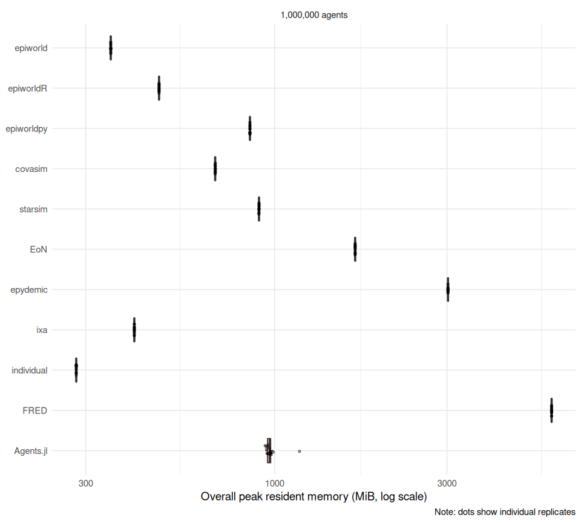

# Scenario 03: SEIRH baseline at 1,000,000 agents

2026-09-30

- [Model](#model)
- [Results](#results)
  - [Simulation time](#simulation-time)
  - [Speed relative to epiworldR](#speed-relative-to-epiworldr)
  - [Time to a first result](#time-to-a-first-result)
  - [The epiworld family](#the-epiworld-family)
  - [Growth with the population](#growth-with-the-population)
  - [Memory](#memory)
  - [Epidemiological sanity checks](#epidemiological-sanity-checks)
- [Interpretation](#interpretation)
  - [How time grows with the
    population](#how-time-grows-with-the-population)
  - [Building once](#building-once)
  - [Why this scenario enforces one replicate at a
    time](#why-this-scenario-enforces-one-replicate-at-a-time)
- [Recorded versions](#recorded-versions)

[Back to the project overview](../README.md) · [Scenario 00
report](../scenario_00/README.md)

[Scenario 00](../scenario_00/README.md) at 1,000,000 agents. The model,
the parameters, the network’s mean degree and rewiring probability, the
100 seed cases, and every runner are those of scenario 00; only the
population is ten times its largest size. Each engine runs 20 replicates
rather than 100, because the slowest ones take tens of seconds per
replicate here. Like every scenario, it runs one replicate at a time;
its `[design]` table in [`scenario.toml`](scenario.toml) sets the size
and replicate count, and enforces the one-at-a-time rule ([see
why](#why-this-scenario-enforces-one-replicate-at-a-time)).

The question this scenario asks is how each engine’s time grows with the
population when the outbreak does not. With 100 seed cases and the same
per-contact risk, the epidemic stays about the same size in absolute
terms: about 6,100 agents are infected at 100,000 agents and 6,600 at
1,000,000 (median attack rates 0.061 and 0.0066). An engine whose work
follows the outbreak should barely slow down. An engine that touches
every agent every day should slow down about tenfold.

## Model

See [scenario 00](../scenario_00/README.md#model) for the model, its
parameters, the timing conventions, and each engine’s implementation.
The runners in [`runners/`](runners) are copies of scenario 00’s.

The transmission multipliers were not recalibrated at this size. Each
engine reuses its 100,000-agent factor from scenario 00, which barely
moved between 10,000 and 100,000 agents. The attack rates below show
that the engines stay aligned.

## Results

> [!TIP]
>
> The complete 220-run design for this scenario is available.

| Field | Value |
|:---|:---|
| CPU | Apple M3 Pro (container sees: Apple (model not reported)) |
| Cores | 10 logical, 10 physical |
| Memory | 12.7 GiB |
| OS | Linux-6.12.13-200.fc41.aarch64-aarch64-with-glibc2.39 |
| Kernel | 6.12.13-200.fc41.aarch64 |
| Container image | 6ab6f982c445 |
| Python | 3.12.11 |
| R | R version 4.5.1 (2025-06-13) – “Great Square Root” |
| Julia | julia version 1.13.1 |
| Rust | rustc 1.98.0 (88d9e12ae 2026-08-18) |
| C++ compiler | c++ (Ubuntu 13.3.0-6ubuntu2~24.04) 13.3.0 |
| Quarto | 1.10.18 |
| Repository commit | 467d650 |
| Workers | 1 |
| Run dates | 2026-09-30 to 2026-10-01 |
| Latest run | 220 executed, 0 cached, 0 failed |

| Engine     |  Agents | Runs | Median simulation (s) | Q1 (s) | Q3 (s) |
|:-----------|--------:|-----:|----------------------:|-------:|-------:|
| epiworldR  | 1000000 |   20 |                 0.024 |  0.023 |  0.024 |
| epiworld   | 1000000 |   20 |                 0.026 |  0.025 |  0.027 |
| epiworldpy | 1000000 |   20 |                 0.027 |  0.026 |  0.028 |
| individual | 1000000 |   20 |                 0.272 |  0.270 |  0.273 |
| ixa        | 1000000 |   20 |                 0.373 |  0.359 |  0.390 |
| Agents.jl  | 1000000 |   20 |                 0.727 |  0.688 |  0.802 |
| EoN        | 1000000 |   20 |                 2.266 |  2.243 |  2.298 |
| covasim    | 1000000 |   20 |                 3.144 |  3.088 |  3.241 |
| FRED       | 1000000 |   20 |                 7.204 |  6.811 |  7.757 |
| starsim    | 1000000 |   20 |                10.962 | 10.780 | 11.119 |
| epydemic   | 1000000 |   20 |                13.333 | 13.246 | 13.499 |

### Simulation time

The primary measure is wall-clock time inside each engine’s simulation
call. The logarithmic scale keeps fast and slow engines legible in one
panel.

### Speed relative to epiworldR

Ratios are matched by replicate seed. Values above one mean that
epiworldR completed the simulation call faster.

| Engine     |  Agents | Median time / epiworldR |     Q1 |     Q3 |
|:-----------|--------:|------------------------:|-------:|-------:|
| epiworld   | 1000000 |                    1.10 |   1.03 |   1.15 |
| epiworldpy | 1000000 |                    1.15 |   1.10 |   1.21 |
| covasim    | 1000000 |                  134.64 | 131.19 | 139.52 |
| starsim    | 1000000 |                  471.29 | 453.60 | 484.84 |
| EoN        | 1000000 |                   96.08 |  94.65 |  98.69 |
| epydemic   | 1000000 |                  571.62 | 552.84 | 587.43 |
| ixa        | 1000000 |                   16.08 |  15.31 |  16.51 |
| individual | 1000000 |                   11.62 |  11.25 |  11.84 |
| FRED       | 1000000 |                  309.84 | 291.92 | 325.40 |
| Agents.jl  | 1000000 |                   31.18 |  28.49 |  34.17 |

### Time to a first result

The simulation time above covers what an engine has to redo for every
replicate on the same network (see [what is
measured](../README.md#run-time)). *Build* is the rest of the setup:
turning the edge list into the engine’s population and network, which a
user does once per network. *Build + simulate* is the time to a first
result once the edge list is in memory. Reading the edge file is shown
but left out of it, because its cost depends on each language’s file
parsing rather than on the engine.

| Engine     |  Agents | Read edges (s) | Build (s) | Simulate (s) | Build + simulate (s) |
|:-----------|--------:|---------------:|----------:|-------------:|---------------------:|
| epiworld   | 1000000 |          0.492 |     0.127 |        0.026 |                0.153 |
| epiworldR  | 1000000 |          0.815 |     0.155 |        0.024 |                0.178 |
| ixa        | 1000000 |          0.288 |     0.003 |        0.373 |                0.376 |
| epiworldpy | 1000000 |          1.531 |     0.365 |        0.027 |                0.392 |
| individual | 1000000 |          0.823 |     0.263 |        0.272 |                0.534 |
| Agents.jl  | 1000000 |          1.808 |     0.170 |        0.727 |                0.905 |
| covasim    | 1000000 |          1.553 |     0.047 |        3.144 |                3.191 |
| EoN        | 1000000 |          1.543 |     3.607 |        2.266 |                5.866 |
| starsim    | 1000000 |          1.523 |     0.001 |       10.962 |               10.963 |
| FRED       | 1000000 |         28.374 |     9.367 |        7.204 |               16.803 |
| epydemic   | 1000000 |          1.492 |     3.558 |       13.333 |               16.948 |

### The epiworld family

| Engine     |  Agents | Median time / epiworld |   Q1 |   Q3 |
|:-----------|--------:|-----------------------:|-----:|-----:|
| epiworldR  | 1000000 |                   0.91 | 0.87 | 0.97 |
| epiworldpy | 1000000 |                   1.06 | 1.03 | 1.07 |

### Growth with the population

Median simulation time at each size, the first two from scenario 00. The
growth column divides the time at 1,000,000 agents by the time at
100,000; the population grew tenfold, the outbreak hardly at all. The
last column is the time to build the model from the edge list, which is
not part of the simulation time (see [Building once](#building-once)).

| Engine | 10,000 agents (s) | 100,000 agents (s) | 1,000,000 agents (s) | Time at 1,000,000 / at 100,000 | Median build at 1,000,000 (s) |
|:---|---:|---:|---:|---:|---:|
| epiworldR | 0.004 | 0.008 | 0.024 | 2.9 | 0.155 |
| epiworld | 0.004 | 0.008 | 0.026 | 3.3 | 0.127 |
| epiworldpy | 0.004 | 0.007 | 0.027 | 3.7 | 0.365 |
| individual | 0.024 | 0.053 | 0.272 | 5.1 | 0.263 |
| ixa | 0.007 | 0.033 | 0.373 | 11.2 | 0.003 |
| Agents.jl | 0.020 | 0.037 | 0.727 | 19.8 | 0.170 |
| EoN | 0.076 | 0.285 | 2.266 | 8.0 | 3.607 |
| covasim | 0.062 | 0.324 | 3.144 | 9.7 | 0.047 |
| FRED | 0.066 | 0.485 | 7.204 | 14.9 | 9.367 |
| starsim | 0.165 | 0.905 | 10.962 | 12.1 | 0.001 |
| epydemic | 0.489 | 1.706 | 13.333 | 7.8 | 3.558 |

### Memory

Resident memory (RSS) of each run, in MiB, as median \[Q1, Q3\] across
replicates. *Simulation memory* is the peak during the simulate timer
less the memory held when it started: the extra memory one replicate
needs. *Model footprint* is what building the reusable model adds after
the edge list is read, and *baseline* is the runtime after its imports.
FRED runs as a child process, so only its overall peak is known. See
“Memory” under “What is measured” in the
[overview](../README.md#memory).

| Engine | Agents | Baseline (MiB) | Model footprint (MiB) | Simulation memory (MiB) | Overall peak (MiB) |
|:---|:---|---:|---:|---:|---:|
| individual | 1000000 | 74.8 \[74.8, 74.8\] | 7.0 \[7.0, 7.0\] | 125.7 \[125.3, 125.8\] | 282.3 \[282.3, 282.3\] |
| epiworld | 1000000 | 3.0 \[3.0, 3.0\] | 233.9 \[233.9, 233.9\] | 28.9 \[28.9, 28.9\] | 351.8 \[351.8, 351.8\] |
| ixa | 1000000 | 2.2 \[2.2, 2.2\] | 0.0 \[0.0, 0.0\] | 329.9 \[329.9, 329.9\] | 408.7 \[408.7, 408.7\] |
| epiworldR | 1000000 | 72.1 \[72.1, 72.1\] | 210.5 \[210.5, 210.5\] | 0.0 \[0.0, 0.0\] | 478.6 \[478.5, 478.6\] |
| covasim | 1000000 | 225.1 \[225.1, 225.1\] | 16.2 \[16.1, 16.3\] | 288.8 \[288.6, 288.8\] | 684.5 \[684.5, 684.8\] |
| epiworldpy | 1000000 | 46.6 \[46.6, 46.6\] | 218.6 \[218.5, 218.6\] | 43.4 \[43.4, 43.4\] | 854.3 \[854.2, 854.3\] |
| starsim | 1000000 | 260.9 \[260.9, 260.9\] | 0.0 \[0.0, 0.0\] | 565.7 \[565.2, 566.0\] | 905.1 \[905.1, 905.2\] |
| Agents.jl | 1000000 | 481.9 \[481.7, 482.1\] | 34.0 \[30.2, 41.9\] | 8.4 \[8.4, 8.7\] | 970.7 \[955.8, 975.0\] |
| EoN | 1000000 | 120.3 \[120.3, 120.3\] | 1182.4 \[1182.4, 1182.5\] | 290.0 \[290.0, 290.0\] | 1670.8 \[1670.8, 1670.8\] |
| epydemic | 1000000 | 117.2 \[117.2, 117.2\] | 1181.0 \[1181.0, 1181.7\] | 1642.8 \[1642.8, 1642.8\] | 3020.0 \[3020.0, 3020.0\] |
| FRED | 1000000 |  |  |  | 5846.8 \[5846.7, 5846.8\] |

### Epidemiological sanity checks

| Engine     |  Agents | Median final attack rate | Median peak hospitalized |
|:-----------|--------:|-------------------------:|-------------------------:|
| Agents.jl  | 1000000 |                    0.007 |                     34.5 |
| covasim    | 1000000 |                    0.007 |                     38.0 |
| EoN        | 1000000 |                    0.007 |                     41.0 |
| epiworld   | 1000000 |                    0.006 |                     32.0 |
| epiworldpy | 1000000 |                    0.006 |                     32.0 |
| epiworldR  | 1000000 |                    0.006 |                     32.0 |
| epydemic   | 1000000 |                    0.007 |                     43.5 |
| FRED       | 1000000 |                    0.006 |                     34.0 |
| individual | 1000000 |                    0.006 |                     34.0 |
| ixa        | 1000000 |                    0.006 |                     30.5 |
| starsim    | 1000000 |                    0.007 |                     40.0 |

## Interpretation

### How time grows with the population

- **The epiworld runners** grow by 3.3 (C++), 2.9 (epiworldR), and 3.7
  (epiworldpy) times. Their daily work follows the outbreak, which
  barely grew. What does grow is `reset()` at the start of `run()`,
  which re-initializes every agent; at this size it is nearly half of
  the run.
- **individual** grows by 5.1 times. Its infection process visits the
  infectious agents’ neighbours, but it also tabulates contacts and
  intersects bitsets over the whole population every day.
- **ixa** grows by 11.2 times. Its `execute()` follows the outbreak, but
  every replicate first rebuilds the context (a million entities, five
  million edges, and the index), which grows with the population and is
  now most of its time.
- **EoN** (8.0 times) and **epydemic** (7.8) follow the outbreak in
  their event handling, but set up state for every node of the network,
  in Python, at the start of each run.
- **Covasim** (9.7 times) and **Starsim** (12.1) update every agent’s
  arrays every day, and Starsim also draws transmission on every edge,
  so they grow about as fast as the population.
- **Agents.jl** grows by 19.8 times. Its daily step visits only the
  infectious agents’ neighbours, but it loops over every agent to find
  them and counts the hospitalized agents over the whole population
  every day.
- **FRED** grows by 14.9 times, faster than the population. Its
  simulation time includes building its places, the million-person
  population, and the five-million-edge network for every replicate,
  which is most of it at this size, and it also spends 28 seconds per
  replicate parsing its model and population files.

At 1,000,000 agents, FRED takes about 7.2 seconds per replicate,
epydemic 13, and Starsim 11, against 0.026 for the C++ runner and 0.37
for ixa. [analysis.md](../analysis.md) measures where epiworld’s and
ixa’s time goes.

### Building once

Building the model from the edge list, which a user does once per
network, takes the epiworld runners 0.13 (C++), 0.15 (epiworldR), and
0.36 (epiworldpy) seconds: several times longer than a 100-day run, but
paid once however many replicates follow. EoN spends 3.6 seconds and
epydemic 3.6 building their NetworkX graphs, which they also reuse, and
Agents.jl 0.17 building its agents and adjacency list. FRED’s 9.4
seconds are its runner writing FRED’s model file, with every edge, and
its synthetic population files. ixa and Starsim have almost nothing to
build once, because they rebuild their whole model for every replicate,
and that time is in their simulation time above.

### Why this scenario enforces one replicate at a time

In a first run with four workers, the scheduler ran four replicates of
the same engine at once, and at this size they competed for memory:
epydemic took 57 to 67 seconds per replicate, against about 17 run
alone, and epiworldpy and EoN slowed too. The `workers = 1` setting in
[`scenario.toml`](scenario.toml) makes this scenario run sequentially
whatever `N_THREADS` says. The other scenarios also run sequentially, by
default, so the growth factors above compare times collected the same
way.

## Recorded versions

| Engine     | Recorded version   |
|:-----------|:-------------------|
| Agents.jl  | 7.0.4              |
| covasim    | 3.1.8              |
| EoN        | 1.92               |
| epiworld   | 0.17.1+g04c4ad8    |
| epiworldpy | 0.17.1-0+gc24b4f9  |
| epiworldR  | 0.17.1.0+gfca60f3  |
| epydemic   | 1.14.1             |
| FRED       | PUB.5.7.0+gbd25f04 |
| individual | 0.1.19             |
| ixa        | 3.1.0              |
| starsim    | 3.6.1              |
