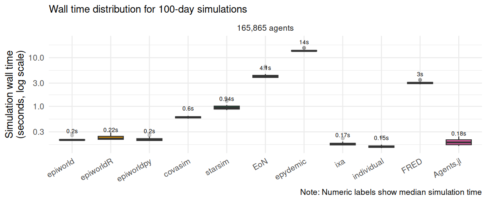
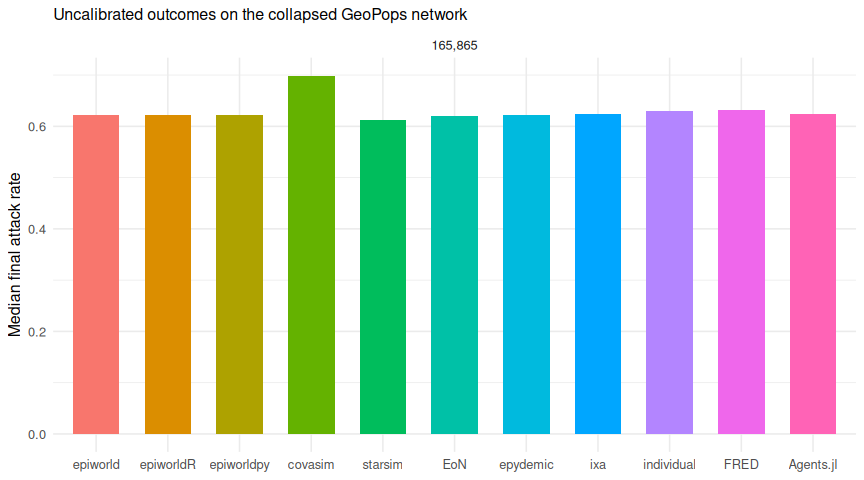

# Scenario 04: SEIRH on a collapsed GeoPops network

2026-09-28

- [Model](#model)
  - [The network](#the-network)
  - [Calibration](#calibration)
  - [Engine implementations](#engine-implementations)
- [Results](#results)
  - [Simulation time](#simulation-time)
  - [Speed relative to epiworldR](#speed-relative-to-epiworldr)
  - [Time to a first result](#time-to-a-first-result)
  - [The epiworld family](#the-epiworld-family)
  - [Epidemiological sanity checks](#epidemiological-sanity-checks)
  - [Code required to define the
    model](#code-required-to-define-the-model)
- [Recorded versions](#recorded-versions)

[Back to the project overview](../README.md) · [Scenario 00
report](../scenario_00/README.md)

[Scenario 00](../scenario_00/README.md)’s model on a real contact
network instead of the shared Watts–Strogatz graph: the model, its
parameters, the 100 seed cases, and the runners in [`runners/`](runners)
are copies of scenario 00’s. Two engines are added here rather than in
scenario 00 because they need extra build steps and are only worth that
cost once: FRED (a compiled, population-and-network-driven simulator)
and Agents.jl (Julia). This scenario also asks a different question from
scenario 00: does the picture change on a graph with real degree
heterogeneity, rather than Watts–Strogatz’s near-constant degree?

## Model

See [scenario 00](../scenario_00/README.md#model) for the disease model,
its parameters, and the timing conventions.

### The network

Every earlier scenario shares a synthetic Watts–Strogatz network (mean
degree 10, rewiring probability 0.05, so nearly every agent has close to
the same number of contacts). This scenario instead uses a network built
from
<a href="https://github.com/GeoPopsHub" target="_blank">GeoPops</a>’
<a href="https://github.com/GeoPopsHub/sc_spartanburg_measles"
target="_blank">Spartanburg County, South Carolina synthetic
population</a>: a real, degree-heterogeneous contact structure, at the
cost of not being able to vary population size independently of the
source data.

[`scripts/generate_network.py`](../scripts/generate_network.py)
downloads GeoPops’ four contact-layer adjacency matrices (household,
workplace, school, and group-quarters, each a checksum-verified
`MatrixMarket` file pinned to a commit), keeps the induced subgraph on
the first 200,000 rows of each, and unions the four layers into one
undirected, unweighted graph. Of those 200,000 people, 34,135 (17%) have
no contacts among the others; they could never be infected, so they are
dropped and the remaining 165,865 renumbered in row order. The result
has 376,526 edges and mean degree 4.54. Layer identity, edge weights,
demographic attributes, and contacts touching excluded rows are
discarded; only which pairs of people are ever in contact survives.
[`scenario.toml`](scenario.toml) records the exact commit and per-layer
checksums.

The graph is still fragmented and heterogeneous. It splits into 17,128
components, and the largest holds 127,291 agents (77%), which caps the
attack rate. Degrees range from 1 to 25 (median 3). Because households
form cliques and degrees vary, the shared analytic mapping, which
divides $R_0$ by the mean degree minus one, does not give an $R_0$ of 2
here: the mean excess degree is 6.9, not 3.5. The mapping is the same
for every engine, so the comparison stays aligned, but the outbreaks are
larger than the nominal $R_0$ suggests.

| Parameter (`scenario.toml`) | Value | Meaning |
|:---|---:|:---|
| Population | 165,865 | people with contacts among the first 200,000 GeoPops rows |
| Edges | 376,526 | after union and dedup |
| Mean degree | 4.54 | observed, not fixed |
| Replicates | 20 | fewer than scenario 00; the slowest engines take seconds per replicate here |

Like scenario 03, this scenario runs one replicate at a time
(`workers = 1` in its `[design]` table), so its timings are comparable
to every other scenario’s default sequential runs.

### Calibration

Scenario 00’s per-engine transmission multipliers were derived from full
runs at 10,000 and 100,000 agents on the Watts–Strogatz network, and do
not carry over to a different topology at a different size. Every engine
therefore runs uncalibrated here (`transmission_multiplier` defaults to
1.0) until a full run’s median attack rates give real factors to
calibrate against; see [`scenario.toml`](scenario.toml).

### Engine implementations

The nine engines from [scenario
00](../scenario_00/README.md#engine-implementations) run the same model
unchanged, reading this scenario’s edge list instead. Two more are
added:

- **FRED** (<a href="https://github.com/PublicHealthDynamicsLab/FRED"
  target="_blank">PublicHealthDynamicsLab/FRED</a>): a compiled,
  DSL-driven simulator with no edge-list network primitive comparable to
  the other engines’ graphs. The runner
  ([`run_FRED.py`](runners/run_FRED.py)) builds a synthetic population
  of 165,865 single-person households (so FRED’s own household mixing
  adds no contacts beyond the network) and loads the benchmark’s edges
  verbatim as `Contact.add_edge` properties on FRED’s `Network` group
  type, with transmission restricted to that network. Each day, an
  infectious agent draws about `transmissibility` × degree contacts
  without replacement among its neighbours, so every neighbour is
  reached with that daily probability, and the runner uses the same
  per-day mapping as the synchronous engines. Latent, infectious, and
  hospital stays are whole days with the configured means. The build
  patches an upstream off-by-one in `Date::setup_dates()` that corrupts
  the heap at this population size (see the
  [Dockerfile](../.devcontainer/Dockerfile)). FRED runs one replicate
  per process and must reread and rebuild everything each time. Its
  timings are split with FRED’s own lap timers: parsing the generated
  model file (which holds every edge) and the population files counts as
  reading, like the other runners’ edge-file parsing; building places,
  the population, and the network, plus the days themselves, count as
  simulation, as ixa’s and Starsim’s per-replicate builds do.
- **Agents.jl** (<a href="https://github.com/JuliaDynamics/Agents.jl"
  target="_blank">JuliaDynamics/Agents.jl</a>): a `StandardABM` with a
  per-agent status and a per-day `model_step!` that scans each
  infectious agent’s adjacency list, matching the synchronous daily
  semantics of epiworldR, epydemic, and individual. The adjacency list
  and transmission math are written for this benchmark, since Agents.jl
  has no built-in epidemic model. Initial cases start infectious, as in
  ixa and individual. Before any timer starts, the runner steps a
  throwaway two-agent model so that Julia compiles its methods;
  otherwise about 0.1 seconds of compilation lands in the first
  simulation.

**MEmilio is deliberately excluded.** Its ABM has no edge-list network
primitive either — agents interact only through shared Locations
(household, work, school, …) — so matching this network would need on
the order of 376,000 synthetic two-person Locations, of unproven
performance, on top of an 8-compartment, viral-load-driven disease model
with no simple SEIRH mapping. See [issue
\#11](https://github.com/UofUEpiBio/epiworld-benchmark/issues/11).

## Results

> [!TIP]
>
> The complete 220-run design for this scenario is available.

| Field               | Value                                                 |
|:--------------------|:------------------------------------------------------|
| Platform            | Linux-6.12.13-200.fc41.aarch64-aarch64-with-glibc2.39 |
| Python              | 3.12.11                                               |
| Workers             | 1                                                     |
| Latest run failures | 0                                                     |

| Engine     | Agents | Runs | Median simulation (s) | Q1 (s) | Q3 (s) |
|:-----------|-------:|-----:|----------------------:|-------:|-------:|
| individual | 165865 |   20 |                 0.148 |  0.144 |  0.154 |
| ixa        | 165865 |   20 |                 0.170 |  0.162 |  0.174 |
| Agents.jl  | 165865 |   20 |                 0.182 |  0.163 |  0.206 |
| epiworld   | 165865 |   20 |                 0.204 |  0.202 |  0.208 |
| epiworldpy | 165865 |   20 |                 0.205 |  0.199 |  0.217 |
| epiworldR  | 165865 |   20 |                 0.216 |  0.211 |  0.242 |
| covasim    | 165865 |   20 |                 0.597 |  0.580 |  0.612 |
| starsim    | 165865 |   20 |                 0.943 |  0.882 |  1.012 |
| FRED       | 165865 |   20 |                 3.025 |  2.940 |  3.104 |
| EoN        | 165865 |   20 |                 4.058 |  3.935 |  4.329 |
| epydemic   | 165865 |   20 |                13.764 | 13.633 | 14.053 |

### Simulation time

The primary measure is wall-clock time inside each engine’s simulation
call. The logarithmic scale keeps fast and slow engines legible in one
panel.

### Speed relative to epiworldR

Ratios are matched by replicate seed. Values above one mean that
epiworldR completed the simulation call faster.

| Engine     | Agents | Median time / epiworldR |    Q1 |    Q3 |
|:-----------|-------:|------------------------:|------:|------:|
| epiworld   | 165865 |                    0.94 |  0.84 |  0.98 |
| epiworldpy | 165865 |                    0.94 |  0.82 |  1.00 |
| covasim    | 165865 |                    2.76 |  2.39 |  2.86 |
| starsim    | 165865 |                    4.26 |  3.85 |  4.73 |
| EoN        | 165865 |                   18.21 | 16.70 | 20.29 |
| epydemic   | 165865 |                   63.47 | 56.16 | 66.45 |
| ixa        | 165865 |                    0.77 |  0.74 |  0.80 |
| individual | 165865 |                    0.66 |  0.63 |  0.70 |
| FRED       | 165865 |                   13.74 | 12.30 | 14.59 |
| Agents.jl  | 165865 |                    0.76 |  0.74 |  0.90 |

### Time to a first result

The simulation time above covers what an engine has to redo for every
replicate on the same network (see [what is
measured](../README.md#run-time)). *Build* is the rest of the setup:
turning the edge list into the engine’s population and network, which a
user does once per network. *Build + simulate* is the time to a first
result once the edge list is in memory.

| Engine     | Agents | Read edges (s) | Build (s) | Simulate (s) | Build + simulate (s) |
|:-----------|-------:|---------------:|----------:|-------------:|---------------------:|
| ixa        | 165865 |          0.030 |     0.000 |        0.170 |                0.170 |
| individual | 165865 |          0.067 |     0.034 |        0.148 |                0.182 |
| Agents.jl  | 165865 |          0.368 |     0.028 |        0.182 |                0.209 |
| epiworld   | 165865 |          0.046 |     0.014 |        0.204 |                0.219 |
| epiworldR  | 165865 |          0.066 |     0.029 |        0.216 |                0.245 |
| epiworldpy | 165865 |          0.133 |     0.055 |        0.205 |                0.259 |
| covasim    | 165865 |          0.139 |     0.048 |        0.597 |                0.643 |
| starsim    | 165865 |          0.135 |     0.000 |        0.943 |                0.943 |
| FRED       | 165865 |          2.653 |     0.765 |        3.025 |                3.788 |
| EoN        | 165865 |          0.134 |     0.463 |        4.058 |                4.527 |
| epydemic   | 165865 |          0.145 |     0.494 |       13.764 |               14.264 |

### The epiworld family

| Engine     | Agents | Median time / epiworld |   Q1 |   Q3 |
|:-----------|-------:|-----------------------:|-----:|-----:|
| epiworldR  | 165865 |                   1.06 | 1.02 | 1.19 |
| epiworldpy | 165865 |                   1.01 | 0.98 | 1.04 |

### Epidemiological sanity checks

Speed is interpretable only if the simulations produce plausible
epidemics. These checks show the final attack rate and peak
hospitalization load.

| Engine     | Agents | Median final attack rate | Median peak hospitalized |
|:-----------|-------:|-------------------------:|-------------------------:|
| Agents.jl  | 165865 |                    0.624 |                    855.0 |
| covasim    | 165865 |                    0.699 |                   1725.5 |
| EoN        | 165865 |                    0.620 |                   1004.0 |
| epiworld   | 165865 |                    0.623 |                    848.5 |
| epiworldpy | 165865 |                    0.623 |                    848.5 |
| epiworldR  | 165865 |                    0.623 |                    848.5 |
| epydemic   | 165865 |                    0.623 |                   1104.5 |
| FRED       | 165865 |                    0.631 |                   1110.5 |
| individual | 165865 |                    0.630 |                   1001.5 |
| ixa        | 165865 |                    0.625 |                    851.5 |
| starsim    | 165865 |                    0.612 |                    968.5 |

### Code required to define the model

A rough measure of effort: how much code each engine needs to express
the model. The counting rules are described in the [project
overview](../README.md#measuring-implementation-effort), and the counted
regions are listed in [`code_regions.yml`](code_regions.yml).

| Engine     | Language | Files | Model lines |
|:-----------|:---------|------:|------------:|
| epiworld   | C++      |     1 |          26 |
| individual | R        |     1 |          32 |
| epiworldpy | Python   |     1 |          34 |
| EoN        | Python   |     1 |          37 |
| epiworldR  | R        |     1 |          47 |
| Agents.jl  | Julia    |     1 |          54 |
| covasim    | Python   |     1 |          64 |
| epydemic   | Python   |     1 |          70 |
| starsim    | Python   |     1 |          83 |
| FRED       | Python   |     1 |          92 |
| ixa        | Rust     |     3 |         138 |

## Recorded versions

| Engine     | Recorded version   |
|:-----------|:-------------------|
| Agents.jl  | 7.0.4              |
| covasim    | 3.1.8              |
| EoN        | 1.92               |
| epiworld   | 0.17.0             |
| epiworldpy | 0.17.0-1+g0733151  |
| epiworldR  | 0.17.0.0           |
| epydemic   | 1.14.1             |
| FRED       | PUB.5.7.0+gbd25f04 |
| individual | 0.1.19             |
| ixa        | 3.1.0              |
| starsim    | 3.6.1              |
